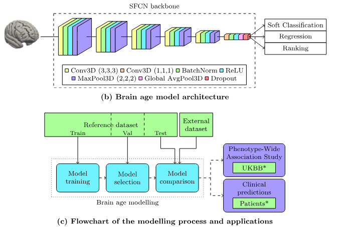

# CPU vs. GPU bei LRP-Heatmaps: MaxPooling-Bug und zwei Lösungswege

Dokumentation der Diagnose und Behebung der Device-Diskrepanz bei
Layer-wise Relevance Propagation (LRP) für die Right-Thalamus-UKB-Modelle
(SFCN, 3D-MaxPooling). Stand: September 2026.

**Kurzfassung der Ursache:** Der TensorFlow-Op `MaxPool3DGrad` verteilt bei
**gleichen Maxima im Pool-Fenster** („Ties“) die Relevanz auf der CPU an
*alle* Gewinner, auf der GPU nur an *einen*. Nach ReLU sind große Bereiche
exakt 0 — dort hat jedes 2×2×2-Fenster acht gleichwertige Maxima. Pro
Pool-Schicht vervielfacht sich die Relevanz dadurch um bis zu Faktor 8, über
vier Schichten multiplikativ auf ~100×. Erschwerend kommt hinzu, dass der
CPU-Kernel nicht bitgenau vergleicht, sondern mit einer absoluten Toleranz
von ~`1e-5` (Abschnitt 3.4).

**Zwei Lösungswege** (Abschnitte 7 und 9; Diagnose in 1–6 bleibt gültig):

| | **Strategie A** — deterministisches WTA | **Strategie B** — Flat-Pooling |
|---|---|---|
| Eingriff | `pooling.py` umbauen (`tf.argmax` + `tf.one_hot`) | nur `LRPStrategy.pooling=…` setzen |
| Alter Grad-Op | entfernt | bleibt |
| Semantik | Winner-Takes-All bleibt | gleichmäßige Verteilung im Fenster |
| `ΣR ≈ y_pred` | ja | ja |
| Kartenoptik | scharf, wie bisherige GPU-Karten | flacher / verwaschener |

---

## 1. Befund (Ausgangslage)

Beim Vergleich derselben LRP-Rechnung für dasselbe Subject und dieselben drei
Input-Varianten (unverändert / gejittert / all-zero außer rechtem Thalamus):

| Gerät | Erscheinungsbild | typische `ΣR` | typisches `max abs(R)` |
|-------|------------------|---------------|------------------------|
| **GPU** | Relevanz lokal am Gewebe, Hintergrund ≈ 0 | ≈ 7 000 (≈ Vorhersage) | 0.5 … 3 |
| **CPU** | starke Rahmen-/Ecken-Artefakte, „wilde“ Karte | ≈ 10⁵ … 10⁶ | räumlich diffus |

Wichtige Beobachtungen:

- **`dtype` war auf beiden Geräten `float32`** — kein dtype-Mismatch.
- **NaN/Inf = 0** auf CPU und GPU — kein Overflow, sondern „stille“ Verzerrung.
- Die **Vorhersage** `y_pred` war auf CPU und GPU fast gleich (`abs(Δ)` &lt; 1.3).
- Auf der GPU galt **`ΣR ≈ y_pred`** (Relevanzerhaltung). Auf der CPU war `ΣR`
  um Größenordnungen zu groß → Conservation gebrochen.

Ein Detail war schon hier verräterisch: Die Inflation war bei der Variante
**all-zero am größten** (Faktor ≈ 608) und bei den bildgefüllten Varianten
kleiner (≈ 108 / 112). Mehr Nullen im Input → stärkerer Fehler. Genau das
passt zur später bestätigten Tie-Ursache.

Der Verdacht „Eval-Modus“ (BatchNorm/Dropout) war nachrangig: BatchNorm wird in
der LRP-Pipeline mit Moving-Stats gefused; der Aufruf lief mit `training=False`.

---

## 2. Was LRP und MaxPooling hier bedeuten (kurz)

LRP verteilt die Relevanz vom Netzausgang **rückwärts** Schicht für Schicht
zurück zum Input. Ideal gilt für jede Schicht:

$$
\sum_i R_i^{(\ell)} \approx \sum_j R_j^{(\ell+1)}
$$

und am Ende

$$
\sum_i R_i^{(\mathrm{input})} \approx f(x)
$$

(hier das vorhergesagte Thalamus-Volumen).

**MaxPooling** behält im Forward-Pass pro Fenster nur das Maximum. Die
LRP-Standardregel dafür ist **Winner-Takes-All (WTA)**:

> Die gesamte Relevanz eines Pool-Ausgangs geht an **genau ein** Voxel — das,
> welches im Forward-Pass das Maximum war. Alle anderen Voxel im Fenster
> bekommen 0.

Zwei Eigenschaften sind dabei entscheidend:

1. **Conservation:** Summe rein = Summe raus (Faktor exakt 1).
2. **Determinismus bei Gleichstand:** Wenn mehrere Voxel denselben Maximalwert
   haben, muss die Regel *einen* auswählen — und zwar auf jedem Gerät
   denselben.

Punkt 2 war genau die Bruchstelle.

---

## 3. Das Zahlenbeispiel: was schieflief

Alle Zahlen unten sind **real gemessen** (TF 2.21), nicht konstruiert:
2×2×2-Fenster, ein Kanal, eingehende Relevanz $R_{\mathrm{out}} = 10$.

### 3.0 Vorab: was `a` ist und was `R` ist

Die beiden Zahlenreihen in den Beispielen haben völlig verschiedene Rollen.
Sie zu verwechseln ist die häufigste Stolperfalle beim Lesen von LRP-Code:

| Symbol | Was es ist | Woher es kommt | Wozu es dient |
|--------|------------|----------------|---------------|
| `a` | die **Aktivierungen** der Schicht *unter* dem Pooling, 8 Werte pro `2×2×2`-Fenster | aus dem **Forward-Pass**, gespeichert | bestimmt **WO** die Relevanz hingeht (wer ist Maximum?) |
| `R` | die **Relevanz** am Pool-Ausgang, 1 Wert pro Fenster | aus dem **Rückweg**, von der Schicht darüber | bestimmt **WIE VIEL** Relevanz verteilt wird |

**Zur ersten Frage — „warum hat ReLU beim Zurückpropagieren überall 0?“:**
Das hat mit dem Rückweg nichts zu tun. Die Nullen stehen in `a`, also in den
*Vorwärts*-Aktivierungen, die längst berechnet und gespeichert sind, bevor LRP
überhaupt anfängt. ReLU ist $\max(0, x)$ und setzt jeden negativen
Prä-Aktivierungswert auf **exakt** `0.0` — nicht auf „klein“, sondern auf die
literale Null. In einem MRT-Volumen ist ein großer Teil des Bildes Luft,
Hintergrund und Zero-Padding; dort feuert praktisch kein Filter positiv, und
die gesamte Region der Feature-Map ist buchstäblich mit `0.0` gefüllt. Ein
`2×2×2`-Fenster, das in einer solchen Region liegt, enthält also acht mal
denselben Wert. Das ist Fall 2.

**Zur zweiten Frage — „woher kommt die 10, warum nicht 15 oder 5?“:**
Die 10 ist **kein Maximum**. Sie ist der frei gewählte Testwert für
$R_{\mathrm{out}}$, also die Relevanz, die von oben in dieses Fenster
hereinkommt. Man hätte genauso 15, 5 oder −3 nehmen können; der Fehler ist
rein multiplikativ und hängt nicht vom Betrag ab:

```
R_out =  5.0  ->  R_in = [ 5,  5,  5,  5,  5,  5,  5,  5]   Sum =   40   Faktor 8
R_out = 10.0  ->  R_in = [10, 10, 10, 10, 10, 10, 10, 10]   Sum =   80   Faktor 8
R_out = 15.0  ->  R_in = [15, 15, 15, 15, 15, 15, 15, 15]   Sum =  120   Faktor 8
R_out = -3.0  ->  R_in = [-3, -3, -3, -3, -3, -3, -3, -3]   Sum =  -24   Faktor 8
```

Das Maximum im Fenster ist dagegen der größte Wert von `a` — in Fall 1 die
`3`, in Fall 2 die `0`, in Fall 3 die `5`. Die Größe dieses Maximums ist für
die Relevanzverteilung **irrelevant**; WTA fragt nur, *welcher Index* gewinnt,
nicht *wie hoch* er ist. Deshalb ist ein Fenster aus lauter Nullen genauso
„gefährlich“ wie eines aus lauter Fünfen.

### 3.1 Fall 1 — eindeutiges Maximum (funktioniert überall)

Aktivierungen im Fenster (als flache Liste der 8 Voxel):

```
a = [1, 3, 2, 0, 0, 0, 0, 0]      Maximum = 3 an Position 1
```

| Implementierung | resultierendes `R_in` | `ΣR_in` |
|-----------------|-----------------------|---------|
| alt, CPU | `[0, 10, 0, 0, 0, 0, 0, 0]` | **10** ✓ |
| alt, GPU | `[0, 10, 0, 0, 0, 0, 0, 0]` | **10** ✓ |
| neu (beide) | `[0, 10, 0, 0, 0, 0, 0, 0]` | **10** ✓ |

Hier ist alles in Ordnung: Conservation hält, die Karte bleibt „spitz“.
Deshalb fiel der Bug in einfachen Unit-Tests nie auf — dort sind die
Testwerte immer eindeutig.

### 3.2 Fall 2 — alle Werte gleich (nach ReLU: alles 0)

```
a = [0, 0, 0, 0, 0, 0, 0, 0]      8 gleichwertige Maxima
```

| Implementierung | resultierendes `R_in` | `ΣR_in` | Faktor |
|-----------------|-----------------------|---------|--------|
| **alt, CPU** | `[10, 10, 10, 10, 10, 10, 10, 10]` | **80** ✗ | **×8** |
| alt, GPU | `[10, 0, 0, 0, 0, 0, 0, 0]` | 10 ✓ | ×1 |
| neu (beide) | `[10, 0, 0, 0, 0, 0, 0, 0]` | 10 ✓ | ×1 |

**Das ist der Bug.** Die CPU-Implementierung von `MaxPool3DGrad` schreibt die
Relevanz an *jede* Position, die dem Maximum entspricht. Aus 10 werden 80.

Zwei Präzisierungen, weil hier leicht ein falsches Bild entsteht:

- Jeder Gewinner bekommt den **vollen** Wert `R`, nicht `R/8`. Es wird
  kopiert, nicht aufgeteilt — deshalb wächst die Summe überhaupt.
- Betroffen sind **nur Fenster mit Gleichstand**. Fenster mit eindeutigem
  Maximum (Fall 1) verhalten sich auf der CPU völlig korrekt. Der Fehler ist
  also nicht flächendeckend, sondern konzentriert sich exakt auf die
  Nullregionen — was erklärt, warum die Artefakte am Rand und im Hintergrund
  sitzen und nicht gleichmäßig über das Bild verteilt sind.

Warum ist das so häufig? Weil nach **ReLU** riesige Teile der Feature-Maps
exakt `0.0` sind — Hintergrund, Luft um den Kopf, Padding-Ränder. Dort ist
*jedes* Fenster ein 8-fach-Tie. Und es bleibt nicht bei den exakten Nullen:
der CPU-Kernel zählt auch *fast* gleiche Werte als Gewinner, siehe 3.4.

### 3.3 Fall 3 — zwei gleiche Maxima

```
a = [5, 0, 0, 0, 0, 0, 0, 5]      2 gleichwertige Maxima
```

| Implementierung | resultierendes `R_in` | `ΣR_in` | Faktor |
|-----------------|-----------------------|---------|--------|
| **alt, CPU** | `[10, 0, 0, 0, 0, 0, 0, 10]` | **20** ✗ | **×2** |
| alt, GPU | `[10, 0, 0, 0, 0, 0, 0, 0]` | 10 ✓ | ×1 |
| neu (beide) | `[10, 0, 0, 0, 0, 0, 0, 0]` | 10 ✓ | ×1 |

Der Vervielfachungsfaktor ist also genau die **Anzahl der Gleichstände** im
Fenster: 1 (kein Tie) bis 8 (alles gleich).

### 3.4 Wie genau müssen die Maxima übereinstimmen?

Die naheliegende Annahme ist „bitgenau gleich“. **Das stimmt nicht** — und das
macht das Problem deutlich größer, als es auf den ersten Blick aussieht.

Messung: `a = [5.0, 0, 0, 0, 0, 0, 0, v]`, wobei `v` schrittweise über 5.0
hinaus erhöht wird. Ein ULP (kleinster darstellbarer Schritt) beträgt bei 5.0
in `float32` rund `4.77e-7`.

| Abstand `v − 5.0` | in ULP | bitgenau gleich? | Gewinner (CPU alt) | `ΣR_in` |
|-------------------|--------|------------------|--------------------|---------|
| 0 | 0 | ja | 2 | 20 ✗ |
| `4.8e-7` | 1 | **nein** | 2 | 20 ✗ |
| `9.5e-7` | 2 | **nein** | 2 | 20 ✗ |
| `3.8e-6` | 8 | **nein** | 2 | 20 ✗ |
| `4.8e-5` | 100 | nein | 1 | 10 ✓ |
| `4.8e-3` | 10 000 | nein | 1 | 10 ✓ |

Der CPU-Kernel behandelt also auch Werte als Gewinner, die **nicht** gleich
sind. Per Bisektion über mehrere Größenordnungen ergibt sich eine
**absolute Toleranz von rund `1e-5`**:

| Referenzwert | gemessene Tie-Toleranz (absolut) | entspricht relativ |
|--------------|----------------------------------|--------------------|
| 0.001 | `1.00e-5` | 1 % (!) |
| 0.1 | `1.00e-5` | `1e-4` |
| 1.0 | `9.95e-6` | `1e-5` |
| 5.0 | `9.78e-6` | `2e-6` |
| 100.0 | `1.14e-5` | `1e-7` |
| 10 000.0 | `4.88e-4` | `5e-8` |

Die Toleranz ist **absolut, nicht relativ** — sie bleibt über vier
Größenordnungen bei ≈ `1e-5` konstant. (Der Ausreißer bei 10 000 ist kein
anderes Verhalten, sondern schlicht die float32-Auflösung: ein ULP ist dort
bereits `4.9e-4`, feiner lässt sich gar nicht testen.)

Die praktische Konsequenz ist unangenehm: Weil die Schwelle absolut ist,
trifft sie **kleine Aktivierungen viel härter**. Bei einer Aktivierung um
`0.001` — in tiefen Feature-Maps völlig normal — entspricht `1e-5` einer
relativen Toleranz von **1 %**. Dort gelten also schon Werte als „gleich“, die
sich im Prozentbereich unterscheiden, und das Fenster wird zum Tie, obwohl es
ein klar bestimmtes Maximum hat.

Die Antwort auf die Frage lautet also: **weder bitgenau noch „auf zwei
Nachkommastellen“, sondern bis auf absolut ~1e-5.** Exakte Nullen nach ReLU
sind nur der häufigste Spezialfall davon — zusätzlich kommen alle Near-Ties
im Bereich `1e-5` dazu.

Zum Vergleich das Verhalten der anderen beiden Pfade:

| `v − 5.0` | CPU alt | GPU alt | neu (beide) |
|-----------|---------|---------|-------------|
| 0 (exakt gleich) | **2 Gewinner** | 1 Gewinner | 1 Gewinner |
| `1e-6` (Near-Tie) | **2 Gewinner** | 1 Gewinner | 1 Gewinner |
| `1e-3` | 1 Gewinner | 1 Gewinner | 1 Gewinner |

GPU und neue Implementierung vergeben **immer genau einen** Gewinner, egal wie
nah die Werte beieinanderliegen. Bei der neuen Fassung ist das kein Zufall,
sondern garantiert: `tf.argmax` liefert konstruktionsbedingt einen einzigen
Index (bei Gleichstand den kleinsten), und `tf.one_hot` erzeugt daraus genau
eine 1.

### 3.5 Ein ganzer Block, beide Pfade nebeneinander

Bisher ging es nur um den MaxPool allein. Jetzt derselbe Vorgang eingebettet in
einen kompletten Block — **einmal im alten CPU-Pfad und einmal im GPU- bzw.
neuen Pfad**, damit sichtbar wird, was die Verdopplung mit den Folgeschichten
macht.

Die Zahlen unten stammen aus einem lauffähigen Mini-Block
(`scripts/probe_block_old_vs_new.py`), nicht aus einer Skizze:

```
Input (2,2,2,1) -> Conv3D(1,1,1) -> BatchNorm -> ReLU -> MaxPool3D(2,2,2)
```

**Forward.** Der Input ist so gewählt, dass nach ReLU ein Gleichstand entsteht:

```
Input :  [ 5, -1, -2, -3, -4, -5, -6,  5]
Conv  :  [ 5, -1, -2, -3, -4, -5, -6,  5]      (Gewicht 1)
BN    :  [ 5, -1, -2, -3, -4, -5, -6,  5]      (identisch parametrisiert)
ReLU  :  [ 5,  0,  0,  0,  0,  0,  0,  5]      <- Positionen 0 und 7 gleich!
Pool  :  [ 5 ]
```

Das ist exakt Fall 3 aus 3.3, nur eingebettet: **zwei gleichwertige Maxima**.

**Rückweg, Schritt für Schritt.** Startrelevanz ist der Pool-Ausgang
(gemessen `4.9975`). Rückweg-Reihenfolge wie in Abschnitt 4.1:

| Schritt | LRP-Klasse | `R` — **alt (CPU)** | `ΣR` | `R` — **GPU / neu** | `ΣR` |
|---------|------------|---------------------|------|---------------------|------|
| Eingang | `ReshapeLRP` | `[4.998]` | 4.998 | `[4.998]` | 4.998 |
| MaxPool3D | `MaxPoolingLRP` | `[4.998, 0,0,0,0,0,0, 4.998]` | **9.995** | `[4.998, 0,0,0,0,0,0, 0]` | 4.998 |
| ReLU | `ReLULRP` | `[4.998, 0,0,0,0,0,0, 4.998]` | **9.995** | `[4.998, 0,0,0,0,0,0, 0]` | 4.998 |
| BatchNorm | `NoOpLRP` | `[4.998, 0,0,0,0,0,0, 4.998]` | **9.995** | `[4.998, 0,0,0,0,0,0, 0]` | 4.998 |
| Conv3D | `Conv3DLRP` | `[4.998, 0,0,0,0,0,0, 4.998]` | **9.995** | `[4.998, 0,0,0,0,0,0, 0]` | 4.998 |

Daraus lassen sich drei Dinge direkt ablesen:

1. **Der Fehler entsteht ausschließlich in Zeile 2.** Vorher sind beide Pfade
   identisch, nachher unterscheiden sie sich um exakt den Faktor 2 — die Zahl
   der Gleichstände im Fenster.
2. **Position 7 bekommt im alten Pfad Relevanz, obwohl sie den Platz mit
   Position 0 teilt.** Beide erhalten den *vollen* Wert `4.998`, nicht die
   Hälfte. Deshalb verdoppelt sich die Summe, statt erhalten zu bleiben.
3. **ReLU, BatchNorm und Conv korrigieren den Fehler nicht** — sie tragen ihn
   unverändert weiter. Das ist der Grund, warum er den nächsten Block
   unvermindert erreicht und dort erneut multipliziert wird.

**Was die Conv-Schicht im Detail damit macht.** Im Mini-Block ist der Kernel
`1×1×1`, deshalb reicht Conv die Werte einfach durch. In einem echten
SFCN-Block mit `3×3×3`-Kernel wird die Relevanz stattdessen aufgeteilt.
Betrachtet sei ein Gewinner-Voxel mit drei Eingangsvoxeln, Aktivierungen
`a = [2, −1, 3]`, Gewichten `w = [1, 2, −1]`, Einzelbeiträge `z_i = a_i · w_i`:

```
z   = [ 2, -2, -3 ]
Σz⁺ =  2        (nur z_0 ist positiv)
Σz⁻ = -5        (z_1 und z_2)
```

Die αβ-Regel lautet $x_i = \alpha \frac{z_i^+}{\Sigma z^+} - \beta \frac{z_i^-}{\Sigma z^-}$, mit α=2, β=1:

```
x_0 = 2 * (2/2)     - 1 * (0/-5)    =  2.0
x_1 = 2 * (0/2)     - 1 * (-2/-5)   = -0.4
x_2 = 2 * (0/2)     - 1 * (-3/-5)   = -0.6
                                      -----
                              Σx  =   1.0
```

Angewandt auf beide Pfade (der Einfachheit halber mit `R = 10` je
Gewinner-Position):

| | **alt (CPU)** | **GPU / neu** |
|---|---|---|
| Positionen mit Relevanz | 2 (Position 0 **und** 7) | 1 (Position 0) |
| Verteilung je Position | `[20, −4, −6]` | `[20, −4, −6]` |
| Ergebnis gesamt | `[20, −4, −6]` **und** `[20, −4, −6]` | `[20, −4, −6]` |
| `ΣR` | **20** ✗ | 10 ✓ |

Zwei Beobachtungen zur Regel selbst: Erstens ist `Σx = α − β = 1`
**konstruktionsbedingt** — Conv ist also für sich conservativ und *kann* den
Fehler des MaxPools gar nicht bemerken, geschweige denn reparieren. Zweitens
dürfen einzelne Relevanzen größer als `R` oder negativ sein (hier 20 und −6 bei
`R = 10`); nur die *Summe* ist festgelegt. Genau deshalb ist `ΣR` die richtige
Diagnosemetrik und nicht `max abs(R)`.

Und hier steckt bereits der Keim für die extremen Werte aus Abschnitt 5.2: Weil
die Empfangsfelder benachbarter Gewinner-Positionen bei einem `3×3×3`-Kernel
**überlappen**, treffen die beiden Verteilungen auf teilweise dieselben
Eingangsvoxel — und dort werden sie **addiert**. Ein geteilter Voxel bekäme
also `20 + 20 = 40`, einen Wert, den es im korrekten Pfad nie gibt.

**Bilanz über den Block:**

| Schritt | `ΣR` alt (CPU) | `ΣR` GPU / neu | was passiert |
|---------|----------------|----------------|--------------|
| Eingang | 10 | 10 | — |
| MaxPool3D (WTA) | **20** | 10 | alt: *beide* Gewinner bekommen den vollen Wert; neu: genau einer |
| ReLU | **20** | 10 | unverändert durchgereicht |
| BatchNorm | **20** | 10 | unverändert durchgereicht |
| Conv3D (αβ) | **20** | 10 | anteilig aufgeteilt, Summe bleibt |

Im korrekten Pfad ist jeder Schritt für sich summenerhaltend — das ist die
Bedingung, damit am Ende `ΣR ≈ y_pred` herauskommt. **Der alte CPU-Pfad
verletzte genau die zweite Zeile**, hier mit Faktor 2, bei einem Fenster aus
lauter Nullen mit Faktor 8. Weil die drei folgenden Schritte die Summe nur
weitertragen, wanderte der Fehler unvermindert in den nächsten Block — und
wurde dort erneut multipliziert. Genau das zeigt Abschnitt 5.

---

## 4. Der Rückweg anschaulich: von 7266 mm³ zurück zum Voxel

Abschnitt 3 hat in *ein* Pool-Fenster hineingezoomt. Dieser Abschnitt zeigt die
ganze Reise — was mit der Vorhersage passiert, während sie Schicht für Schicht
zum Input zurückläuft.

### 4.1 Die Architektur und ihre Reihenfolge



Das SFCN-Backbone besteht aus fünf gleichartigen Blöcken. Im **Forward**-Pass
ist die Reihenfolge innerhalb eines Blocks:

```
Conv3D (3,3,3)  ->  BatchNorm  ->  ReLU  ->  MaxPool3D (2,2,2)
```

Der LRP-Rückweg läuft genau umgekehrt durch denselben Block:

```
MaxPool3D  ->  ReLU  ->  BatchNorm  ->  Conv3D
```

Danach folgen Top-Block (`Conv3D (1,1,1)` → BatchNorm → ReLU),
`Global AvgPool3D`, `Dropout` und der Regressionskopf.

Das ist auch der Grund, warum die MaxPool-Schichten im Diagnose-Log in
**Vierer-Schritten** auftauchen (`LRP_8`, `LRP_12`, `LRP_16`, `LRP_20`,
`LRP_24`): Jeder Block liefert genau vier LRP-Schichten.

### 4.2 Was jede Schichtsorte auf dem Rückweg tatsächlich tut

| Rückweg-Schritt | LRP-Klasse im Code | Was mit `R` passiert | `ΣR` |
|-----------------|--------------------|----------------------|------|
| **MaxPool3D** | `MaxPoolingLRP` (WTA) | `R` wird **umverteilt**: pro `2×2×2`-Fenster geht alles an den Gewinner-Voxel, die anderen 7 bekommen 0. Die Karte wird 8× größer (Upsampling), aber dünner besetzt. | unverändert |
| **ReLU** | `ReLULRP` | **nichts** — `R` wird unverändert durchgereicht (`return R`). | unverändert |
| **BatchNorm** | `NoOpLRP` | **nichts** — Durchreicher. BatchNorm ist zur Inferenzzeit eine affine Transformation pro Kanal und wird für die Relevanzzuweisung ignoriert. | unverändert |
| **Conv3D** | `Conv3DLRP` (αβ / ε / flat) | Hier passiert die **eigentliche Arbeit**: `R` wird anteilig auf die Eingangsvoxel verteilt, proportional zu deren Beitrag `z_ij` zum Ausgang. | unverändert (bis auf ε-Terme) |

Zwei Dinge sind daran überraschend und lohnen die Betonung:

**ReLU macht auf dem Rückweg nichts.** Man würde erwarten, dass ReLU die
Relevanz dort abschneidet, wo die Aktivierung 0 war. Im Code ist genau das
auskommentiert:

```python
# explainability/layers/activations.py
def call(self, inputs):
    a, R = inputs
    # return tf.where(a > 0, R, tf.zeros_like(R), name=self.name)
    return R
```

Das ist bei LRP üblich und korrekt: Die Information „wo war die Aktivierung
positiv?" steckt schon in den `z_ij` der Conv-Schicht davor bzw. in der
Gewinnerwahl des MaxPools. ReLU zweimal zu berücksichtigen würde Relevanz
vernichten.

**BatchNorm macht auf dem Rückweg ebenfalls nichts.** In
`explainability/layers/__init__.py` wird `BatchNormalization` auf `NoOpLRP`
gemappt. Eine Klasse `BatchNormalizationLRP` existiert in
`normalization.py`, ist aber nicht verdrahtet.

Damit bleibt: **Nur MaxPool und Conv bewegen Relevanz.** Deshalb konnte der Bug
überhaupt nur an einer dieser beiden Stellen sitzen — und die layerweise
Messung hat ihn dem MaxPool zugeordnet.

### 4.3 Der vollständige Rückweg in Zahlen (gemessen, GPU, Strategie A)

Subject `IDX_PRED = 1`, Modell „unverändert", Input `(1, 167, 212, 160, 1)`.
Forward-Ergebnis: **`y_pred = 7266.43 mm³`**. Dieser Wert wird
zurückpropagiert:

| LRP-Schicht | Typ | Shape von `R` | `ΣR` | Faktor | `max abs(R)` | Nullen in `R` |
|-------------|-----|---------------|------|--------|--------------|---------------|
| `output_mask` | `Lambda` | `(1, 1)` | 7262.71 | — | 7262.71 | 0 % |
| `LRP_0` | `AddLRP` | `(1, 1)` | 7262.71 | 1.000 | 7262.71 | 0 % |
| `LRP_1` | `ReLULRP` | `(1, 1)` | 7262.71 | 1.000 | 7262.71 | 0 % |
| `LRP_2` | `DenseLRP` | `(1, 64)` | 7251.84 | 0.999 | 154.33 | 7.8 % |
| `LRP_3` | `NoOpLRP` (Dropout) | `(1, 64)` | 7251.84 | 1.000 | 154.33 | 7.8 % |
| `LRP_4` | `AveragePoolingLRP` | `(1, 10, 13, 10, 64)` | 7251.84 | 1.000 | 1.54 | 29.1 % |
| `LRP_5` | `ReLULRP` | `(1, 10, 13, 10, 64)` | 7251.84 | 1.000 | 1.54 | 29.1 % |
| `LRP_6` | `NoOpLRP` (BN) | `(1, 10, 13, 10, 64)` | 7251.84 | 1.000 | 1.54 | 29.1 % |
| `LRP_7` | `Conv3DLRP` | `(1, 10, 13, 10, 256)` | 7251.85 | 1.000 | 32.59 | 82.8 % |
| `LRP_8` | **`MaxPoolingLRP`** (`1×1×1`) | `(1, 10, 13, 10, 256)` | 7251.85 | 1.000 | 32.59 | 82.8 % |
| `LRP_9` | `ReLULRP` | `(1, 10, 13, 10, 256)` | 7251.85 | 1.000 | 32.59 | 82.8 % |
| `LRP_10` | `NoOpLRP` (BN) | `(1, 10, 13, 10, 256)` | 7251.85 | 1.000 | 32.59 | 82.8 % |
| `LRP_11` | `Conv3DLRP` | `(1, 10, 13, 10, 256)` | 7251.76 | 1.000 | 57.60 | 73.4 % |
| `LRP_12` | **`MaxPoolingLRP`** (`2×2×2`) | `(1, 20, 26, 20, 256)` | 7251.76 | 1.000 | 57.60 | **96.7 %** |
| `LRP_13` | `ReLULRP` | `(1, 20, 26, 20, 256)` | 7251.76 | 1.000 | 57.60 | 96.7 % |
| `LRP_14` | `NoOpLRP` (BN) | `(1, 20, 26, 20, 256)` | 7251.76 | 1.000 | 57.60 | 96.7 % |
| `LRP_15` | `Conv3DLRP` | `(1, 20, 26, 20, 128)` | 7251.84 | 1.000 | 24.98 | 74.0 % |
| `LRP_16` | **`MaxPoolingLRP`** (`2×2×2`) | `(1, 41, 53, 40, 128)` | 7251.84 | 1.000 | 24.98 | **96.9 %** |
| `LRP_17` | `ReLULRP` | `(1, 41, 53, 40, 128)` | 7251.84 | 1.000 | 24.98 | 96.9 % |
| `LRP_18` | `NoOpLRP` (BN) | `(1, 41, 53, 40, 128)` | 7251.84 | 1.000 | 24.98 | 96.9 % |
| `LRP_19` | `Conv3DLRP` | `(1, 41, 53, 40, 64)` | 7251.73 | 1.000 | 10.87 | 60.3 % |
| `LRP_20` | **`MaxPoolingLRP`** (`2×2×2`) | `(1, 83, 106, 80, 64)` | 7251.74 | 1.000 | 10.87 | **95.1 %** |
| `LRP_21` | `ReLULRP` | `(1, 83, 106, 80, 64)` | 7251.74 | 1.000 | 10.87 | 95.1 % |
| `LRP_22` | `NoOpLRP` (BN) | `(1, 83, 106, 80, 64)` | 7251.74 | 1.000 | 10.87 | 95.1 % |
| `LRP_23` | `Conv3DLRP` | `(1, 83, 106, 80, 32)` | 7246.79 | 0.999 | 0.077 | 2.9 % |
| `LRP_24` | **`MaxPoolingLRP`** (`2×2×2`) | `(1, 167, 212, 160, 32)` | 7246.78 | 1.000 | 0.077 | **87.9 %** |
| `LRP_25` | `ReLULRP` | `(1, 167, 212, 160, 32)` | 7246.78 | 1.000 | 0.077 | 87.9 % |
| `LRP_26` | `NoOpLRP` (BN) | `(1, 167, 212, 160, 32)` | 7246.78 | 1.000 | 0.077 | 87.9 % |
| `LRP_27` | `Conv3DLRP` (flat) | `(1, 167, 212, 160, 1)` | 7316.01 | 1.010 | 0.552 | 3.4 % |

Endergebnis: `ΣR / y_pred = 7316.01 / 7266.43 = **1.0068**` — Conservation
hält über 28 Schichten auf 0.7 % genau.

Die Spalte **Shape** erzählt die eigentliche Geschichte des Rückwegs: Die
Relevanz startet als **eine einzige Zahl** (7262.71, das vorhergesagte
Volumen) und wird schrittweise auf immer mehr Voxel aufgeteilt — über
`(1, 64)`, `(10, 13, 10)`, `(20, 26, 20)`, `(41, 53, 40)`, `(83, 106, 80)` bis
zu `(167, 212, 160)`, also 5.7 Millionen Voxeln. Die Summe bleibt dabei
konstant, nur die Stückelung wird feiner: `max abs(R)` fällt von 7262 auf 0.55.

**Die MaxPool-Schritte sind genau die Stellen, an denen die räumliche
Auflösung verdoppelt wird** (`10→20→41→83→167`). Und genau dort springt der
Anteil der Nullen in `R` nach oben, z. B. bei `LRP_12` von 73.4 % auf 96.7 %.
Das ist WTA in Aktion: Von 8 Voxeln pro Fenster bekommt einer alles, sieben
bekommen 0 — also mindestens 87.5 % Nullen, plus die schon vorher leeren
Regionen.

### 4.4 Warum genau hier der CPU-Fehler zuschlug

Der Rückweg hat also fünf Stellen, an denen die Relevanz auf ein feineres
Gitter verteilt wird, und an jeder dieser Stellen muss ein Gewinner gewählt
werden. Wie häufig dabei ein Gleichstand auftritt, zeigt der Anteil exakter
Nullen in den ReLU-Ausgaben des Forward-Passes (dieselbe Messung, GPU):

| ReLU-Schicht | Shape | Anteil exakter Nullen | `max(a)` |
|--------------|-------|-----------------------|----------|
| `block-0_relu` | `(167, 212, 160, 32)` | 59.4 % | 33.41 |
| `block-1_relu` | `(83, 106, 80, 64)` | 68.1 % | 17.77 |
| `block-2_relu` | `(41, 53, 40, 128)` | 83.0 % | 6.98 |
| `block-3_relu` | `(20, 26, 20, 256)` | **88.7 %** | 6.45 |
| `block-4_relu` | `(10, 13, 10, 256)` | 82.8 % | 19.07 |
| `top_relu` | `(10, 13, 10, 64)` | 29.1 % | 121.14 |

Zum Vergleich: der Input selbst besteht zu 68.2 % aus exakten Nullen
(Hintergrund und Zero-Padding um den Schädel).

Damit schließt sich der Kreis zu Abschnitt 3: In einer Feature-Map, die zu
83–89 % aus exakten Nullen besteht, ist die überwiegende Mehrheit aller
`2×2×2`-Fenster ein vollständiger 8-fach-Tie. Auf der CPU vervielfachte der
alte `MaxPool3DGrad` dort die Relevanz um bis zu Faktor 8 — an fünf Stellen
hintereinander. Die Tabelle in 4.3 zeigt, wie das nach dem Fix aussieht:
Faktor 1.000 an jeder einzelnen Pool-Schicht.

Die Messung ist reproduzierbar über `scripts/probe_lrp_walkthrough.py`
(Rohwerte in `output/cpu_gpu_lrp_followup/walkthrough_layerwise.csv`).

---

## 5. Wie sich der Fehler aufschaukelte

Ein einzelner Faktor 2–8 wäre schon falsch, aber sichtbar wäre vor allem die
**Verkettung**: SFCN hat fünf MaxPool-Schichten (vier mit `2×2×2`, eine
Identity mit `1×1×1`). Der Fehler wirkt **multiplikativ**.

Gemessene layerweise Relevanzsumme (Subject `1877470…`, Variante „normal“,
CPU, **vor** dem Fix; LRP läuft vom Ausgang zum Input):

| LRP-Schritt | Schicht | `ΣR` davor | `ΣR` danach | Faktor der Schicht |
|-------------|---------|------------|-------------|--------------------|
| Start | Mask (Logit) | — | 7 262 | — |
| LRP_8 | MaxPool (`1×1×1`) | 7 252 | 7 252 | **×1.00** |
| LRP_12 | MaxPool (`2×2×2`) | 7 252 | 8 718 | **×1.20** |
| LRP_16 | MaxPool (`2×2×2`) | 8 718 | 19 371 | **×2.22** |
| LRP_20 | MaxPool (`2×2×2`) | 19 371 | 99 299 | **×5.13** |
| LRP_24 | MaxPool (`2×2×2`) | 99 207 | 774 686 | **×7.81** |
| Ende | Input-Heatmap | — | 782 003 | — |

Die Rechnung geht exakt auf:

$$
1.00 \times 1.20 \times 2.22 \times 5.13 \times 7.81 \approx 106.8
$$

und gemessen war

$$
\frac{\Sigma R_{\mathrm{Ende}}}{\Sigma R_{\mathrm{Start}}}
= \frac{782\,003}{7\,262} \approx 107.7 .
$$

Drei Dinge lassen sich daran direkt ablesen:

1. **Nur die MaxPools inflationieren.** Die Conv-Schichten dazwischen ändern
   `ΣR` um Bruchteile von Prozent. Der Sprung sitzt ausschließlich in
   `MaxPoolingLRP`.
2. **Der Faktor wächst Richtung Input** (1.20 → 2.22 → 5.13 → 7.81). Je näher
   am Input, desto größer die Feature-Map und desto mehr leerer Hintergrund →
   desto mehr 8-fach-Ties. Der letzte Faktor liegt mit 7.81 knapp unter dem
   theoretischen Maximum 8.
3. **Die `1×1×1`-Identity-Pool-Schicht hat Faktor exakt 1.00** — logisch, denn
   in einem Ein-Voxel-Fenster kann es keinen Gleichstand geben.

Das erklärt auch die Variantenabhängigkeit aus Abschnitt 1: Beim
**all-zero**-Input ist fast alles Hintergrund, also fast überall 8-fach-Tie →
Inflation ≈ 608 statt ≈ 108.

### 5.1 Warum die Karten *räumlich* kaputt waren, nicht nur die Summe

Die duplizierte Relevanz landet per Definition auf den **Tie-Positionen** —
und das sind überwiegend Nullregionen: Hintergrund, Bildränder, Padding.
Deshalb:

| Kennzahl (Anteil `abs(R)` in Null-Voxeln) | CPU vorher | GPU vorher |
|-------------------------------------------|------------|------------|
| Variante normal | 97.2 % | 30.4 % |
| Variante jittered | 96.4 % | 37.2 % |
| Variante all-zero | 99.8 % | 72.1 % |

Auf der CPU saßen also ~97 % der Relevanz dort, wo der Input gar keine
Information hat. Das sind exakt die beobachteten Rahmen- und Eckartefakte.

Daraus folgt auch, warum ein Zwischenversuch scheiterte: **`ΣR` nach jedem
MaxPool einfach zurückzuskalieren** stellt zwar die Summe wieder her, lässt
die Relevanz aber weiterhin über alle Tie-Positionen verschmiert. Das Ergebnis
war eine summenkorrekte, aber räumlich diffuse Karte (`max abs(R)` fiel von
0.55 auf 0.016). Das Routing selbst musste korrigiert werden, nicht die Skala.

### 5.2 Warum einzelne Werte am Ende so extrem groß wurden

Die naheliegende Vermutung ist: Wenn der MaxPool Relevanz vervielfacht, werden
die Einzelwerte eben immer größer. **Das ist nachweislich falsch.**

Messung mit zurückgepatchtem alten MaxPool, beides auf CPU, gleiches Subject
(`scripts/probe_old_vs_new_maxpool.py`):

| LRP-Schicht | `ΣR` alt | `ΣR` neu | `max abs(R)` alt | `max abs(R)` neu |
|-------------|----------|----------|------------------|------------------|
| `LRP_7` Conv3D | 7 251.58 | 7 251.58 | 32.5986 | 32.5986 |
| `LRP_11` Conv3D | 7 251.58 | 7 251.58 | 57.6024 | 57.6024 |
| `LRP_12` MaxPool | **8 717.54** | 7 251.58 | 57.6024 | 57.6024 |
| `LRP_16` MaxPool | **19 370.89** | 7 251.58 | 24.9824 | 24.9824 |
| `LRP_20` MaxPool | **99 300.23** | 7 251.59 | 10.8656 | 10.8656 |
| `LRP_24` MaxPool | **774 695.63** | 7 246.65 | 0.0773 | 0.0773 |
| `LRP_27` Conv3D (Input) | **782 012.81** | 7 315.89 | **1.7182** | **0.5518** |

Die Spalte `max abs(R)` ist über den gesamten Rückweg **bitgenau identisch** —
bis zur allerletzten Schicht. Das ist der Schlüssel: **Duplizieren vergrößert
keinen einzelnen Wert.** Ein Tie-Fenster kopiert dieselbe Zahl auf acht
Positionen; das Maximum bleibt genau dieses eine Zahl. Was wächst, ist
ausschließlich die Summe — also die *Anzahl* besetzter Voxel.

Genau das zeigt die Besetzungsmessung direkt vor der letzten Conv-Schicht
(`scripts/probe_occupancy.py`):

| bei `LRP_24` | alt | neu | Verhältnis |
|--------------|-----|-----|------------|
| besetzte Voxel (`R ≠ 0`) | **84.0 %** (152.3 Mio) | **12.1 %** (21.9 Mio) | ×7.0 |
| mittleres `abs(R)` der besetzten Voxel | 0.005555 | 0.000350 | ×15.9 |
| `max abs(R)` | 0.0773 | 0.0773 | ×1.0 |
| `ΣR` | 774 696 | 7 247 | ×106.9 |

Die Summeninflation von ×106.9 setzt sich also zusammen aus **7× mehr
besetzten Voxeln** und **16× größeren typischen Werten** (7.0 × 15.9 ≈ 111).
Aber: Der Spitzenwert selbst ist unverändert.

**Die extremen Werte entstehen erst in der letzten Faltung — durch
Aufsummieren.** Die finale `Conv3D`-Schicht bildet 32 Kanäle auf 1 ab, mit
einem `3×3×3`-Kernel. Jedes Input-Voxel bekommt also
`3 · 3 · 3 · 32 = 864` Beiträge aufaddiert. Solange die Karte dünn besetzt ist
(neu: 12 %), sind die meisten dieser 864 Beiträge exakt 0 und es kommt wenig
zusammen. Bei 84 % Besetzung addieren sich dagegen fast alle 864 Beiträge auf:

```
alt:  0.005555 * 864 = 4.80   ->  tatsaechliches max abs(R) = 1.72
neu:  0.000350 * 864 = 0.30   ->  tatsaechliches max abs(R) = 0.55
```

(Die Abschätzung liegt über dem echten Wert, weil sich positive und negative
Beiträge der αβ-Regel teilweise aufheben — die Größenordnung stimmt aber.)

Das Resultat in Zahlen: Im alten Pfad überschreiten **48 986 Voxel** den Wert
`abs(R) > 1`, im neuen **kein einziges**.

Die Antwort lautet also: Die großen Werte kommen **nicht** aus dem MaxPool
selbst, sondern daraus, dass der MaxPool den Hintergrund mit Relevanz
*auffüllt* und die nachfolgende Faltung diese vielen kleinen Beiträge dann
**kohärent aufaddiert**. Weil das Auffüllen genau in den Nullregionen
passiert, entstehen die Spitzen dort, wo der Input gar keine Information hat —
und das sieht man als Rahmen- und Eckartefakte.

---

## 6. Vorgehen: wie der Fehler eingegrenzt wurde

### Schritt A — Reproduktion

Gleiche Modelle, gleiches Subject, gleiche Composite-Strategie, einmal unter
`tf.device("/CPU:0")`, einmal unter `tf.device("/GPU:0")`, jeweils
`training=False`, Input `float32`. Befund reproduzierbar.

### Schritt B — dtype und Forward ausschließen

- Volumes und Heatmaps: überall `float32` → dtype-Hypothese widerlegt.
- Nur `model(x)` ohne LRP: `abs(y_cpu − y_gpu)` ≈ 0.1 … 1.2 bei Werten ~7 000.
- Erste/letzte Conv3D-Aktivierungen: relative Differenz &lt; 0.3 %.

→ Der Unterschied entsteht im **LRP-Rückweg**, nicht im Forward.

### Schritt C — Conservation als Messgröße

- GPU: `ΣR / y_pred ≈ 1.00`
- CPU: `ΣR / y_pred ≈ 108 … 608`

→ Es ist kein Rundungsproblem, sondern ein **struktureller** Fehler. Eine reine
Float-Ungenauigkeit erzeugt keinen Faktor 100.

### Schritt D — Layerweise `ΣR` (der entscheidende Schritt)

Ein Probe-Modell mit Output nach jeder LRP-Schicht (Mask, StandardLRP,
Pooling) liefert die Tabelle aus Abschnitt 5. Damit war der Ort eindeutig:
**die MaxPool-Schichten**, und zwar nur auf der CPU.

### Schritt E — Isolation in einem Minimalbeispiel

Statt weiter mit 3D-MRT zu arbeiten: ein einzelnes 2×2×2-Fenster, acht Zahlen,
`R_out = 10`, direkt gegen `MaxPool3DGrad` — einmal CPU, einmal GPU. Damit
kamen die Fälle aus Abschnitt 3 heraus und die Tie-Hypothese war bewiesen
(und nicht nur plausibel).

Das ist der eigentliche Erkenntnisschritt: vom „die Karte sieht komisch aus“
über „die Summe stimmt nicht“ und „die Summe bricht an dieser Schichtsorte“
bis zu „dieser Op verhält sich bei Gleichstand geräteabhängig“.

### Schritt F — Fix und Verifikation

Nach dem Umbau (Strategie A, Abschnitt 7) erneut CPU vs. GPU auf denselben Daten:

| Metrik | vor Fix | nach Fix |
|--------|---------|----------|
| `ΣR` CPU vs. GPU | 7.8e5 vs. 7.3e3 | 7 282 vs. 7 282 |
| `max abs(R)` CPU vs. GPU | 0.016 vs. 0.551 (nach Rescale-Versuch) | 0.5515 vs. 0.5513 |
| relative Abweichung der Karten | ≈ 100 % | **0.3 – 0.5 %** |
| Anteil `abs(R)` in Null-Voxeln | 97 % vs. 30 % | 30.3 % vs. 30.3 % |
| `ΣR / y_pred` | 108 vs. 1.00 | 1.002 vs. 1.002 |

Unit-Tests für MaxPool-LRP (2D/3D, global, redistribute, flat) blieben grün.

---

## 7. Strategie A — deterministisches Winner-Takes-All in `pooling.py`

Alles in `explainability/layers/pooling.py`. Die öffentliche API
(`LRP(...)`, `LRPStrategy(...)`, Strategienamen) bleibt unverändert.
Die Semantik bleibt Winner-Takes-All; nur das Routing wird geräteunabhängig.
Das ist der „harte“ Fix, wenn scharfe Heatmaps und echte WTA-Semantik
gewünscht sind.

### 7.1 Entfernt

| Entfernt | Warum |
|----------|-------|
| Import von `MaxPoolGradV2` und `MaxPool3DGrad` aus `tensorflow.raw_ops` | Diese Gradient-Ops sind die Fehlerquelle: geräteabhängiges Tie-Verhalten. |
| `tf.nn.max_pool(...)`-Forward-Aufruf in `_winner_takes_all` | Wurde nur gebraucht, um `orig_output` für die Grad-Ops zu liefern. Ohne Grad-Op überflüssig. |
| Die `ksize = [1] + ksize + [1]`-Umformung und die drei `if/elif`-Zweige (2D / GlobalMaxPooling3D / MaxPooling3D) mit den Grad-Op-Aufrufen | Ersetzt durch die Index-Route. |

Der alte Kern sah so aus:

```python
forward = tf.nn.max_pool(a, ksize=ksize, strides=strides, padding=padding)
...
gradients = MaxPool3DGrad(orig_input=a, orig_output=forward, grad=R,
                          ksize=ksize, strides=strides,
                          padding=padding, data_format='NDHWC')
return gradients
```

Das Problem daran ist konzeptionell: `MaxPool*Grad` implementiert den
**Gradienten** von MaxPool. Beim Training ist es nicht kritisch, ob ein
Gleichstand an einen oder an alle Gewinner verteilt wird — es ist ohnehin eine
Subgradienten-Wahl, und die Gewichtsupdates gleichen das aus. Für LRP ist es
kritisch, weil dort die **Summe eine erhaltene Größe** ist.

**Nicht entfernt:** `AvgPool3DGrad` / `AvgPoolGrad`. Die bleiben für die
Strategien `redistribute` und `flat` in `_redistribute` in Gebrauch. Average
Pooling hat kein Tie-Problem, weil nicht ausgewählt, sondern proportional
verteilt wird.

### 7.2 Warum die Grad-Ops ersatzlos entfallen konnten

Die naheliegende Rückfrage lautet: Wenn man einen TensorFlow-Kernel streicht,
muss man dessen Funktionalität doch irgendwo nachbauen — warum tauchen
`MaxPoolGradV2` und `MaxPool3DGrad` in der neuen Fassung nirgends mehr auf?

**Weil LRP die Ops nie wegen ihrer Gradienten-Eigenschaft gebraucht hat,
sondern nur als bequemen Router.**

Winner-Takes-All-LRP ist mathematisch identisch zum MaxPool-Gradienten, wenn
man den eingehenden Gradienten durch die Relevanz ersetzt. Der ursprüngliche
Autor hat das ausgenutzt: statt das Routing selbst zu schreiben, wurde der
fertige Gradient-Kernel „zweckentfremdet“. Das ist eine Abkürzung, keine
Notwendigkeit — und sie hat den geräteabhängigen Tie-Handler mit eingekauft.

Was der Op intern tatsächlich tut, zerfällt in vier Teilaufgaben. Alle vier
sind elementar ersetzbar:

| Teilaufgabe von `MaxPool*Grad` | Ersatz in der neuen Fassung |
|-------------------------------|------------------------------|
| Fenster gemäß `ksize`/`strides`/`padding` bestimmen | `tf.reshape` + `tf.transpose` (Blockzerlegung) |
| Gewinner finden (Werte mit `orig_output` vergleichen) | `tf.argmax` über die Fensterachse |
| Eingehenden Wert an die Gewinnerposition streuen | `tf.one_hot` × `R` (lokal) bzw. `tf.scatter_nd` (global) |
| Randstreifen behandeln, den `VALID` verworfen hat | `tf.pad` |

Nichts davon braucht Autodiff-Maschinerie. Insbesondere wird `orig_output` gar
nicht mehr benötigt — der Gewinner ergibt sich direkt aus `a`, ohne den
Forward-Max-Pass. Deshalb konnte auch der `tf.nn.max_pool`-Aufruf mitentfallen;
der neue Pfad ist sogar etwas billiger als der alte.

**Der entscheidende Grund, warum der Ersatz so knapp ausfällt**, ist die
Einschränkung auf `pool_size == strides` mit `VALID`: Dann **kacheln die
Fenster den Input disjunkt**. Jedes Voxel gehört zu genau einem Fenster, die
Zuordnung Fenster ↔ Voxel ist also eine reine Umformung der Achsen — ein
`reshape`. Es gibt nichts zu akkumulieren.

Bei überlappenden Fenstern (z. B. `pool=2, stride=1`) wäre das falsch: Dort
liegt ein Voxel in bis zu 8 Fenstern und kann mehrfach gewinnen, die Beiträge
müssten **aufaddiert** werden. Genau diese Allgemeinheit leistet
`MaxPool*Grad` — und genau sie brauchen die SFCN-Modelle und die Unit-Tests
nicht. Deshalb steht dort jetzt bewusst ein `NotImplementedError` statt einer
stillen Näherung (siehe 7.4).

Dass der Ersatz korrekt ist, lässt sich direkt nachmessen. Auf stetigen
Zufallsdaten (also praktisch ohne Gleichstände) sind alter Op und neue Route
**bit-identisch**:

```
3D ohne Ties: bit-identisch = True | maxdiff = 0.0
2D ohne Ties: bit-identisch = True | maxdiff = 0.0
```

Und auf ReLU-Aktivierungen (viele Nullen, also viele Ties) trennen sich die
Wege genau dort, wo sie sollen:

```
nach ReLU:  ΣR alt (CPU) = 22.099   ΣR neu = 23.823   ΣR_out = 23.823
```

Die neue Route erhält die Summe exakt; die alte weicht ab. (Hier nach unten,
weil das Test-`R` auch negative Einträge hat und Ties diese mitduplizieren —
das Vorzeichen der Abweichung hängt vom Relevanzmuster ab, nicht nur die
Größe.)

Kurz: Die beiden Grad-Ops fehlen nicht, weil ihre Funktion woanders hin
verschoben wurde, sondern weil von ihrem Funktionsumfang nur ein kleiner,
klar umrissener Teil je gebraucht wurde — und dieser Teil in fünf
Tensor-Operationen deterministisch ausformuliert werden kann.

### 7.3 Neu hinzugekommen

| Neue Funktion | Aufgabe |
|---------------|---------|
| `_wta_nonoverlapping_3d(a, R, pool_size)` | Der eigentliche Fix für SFCN: zerlegt die Feature-Map in nicht überlappende `kd×kh×kw`-Blöcke, bestimmt pro Block **`tf.argmax`** und schreibt `R` per One-Hot nur an diesen einen Index. |
| `_wta_nonoverlapping_2d(a, R, pool_size)` | Dasselbe für 2D-Modelle (VGG-artige Notebooks, Unit-Tests). |
| `_global_wta(a, R)` | WTA für `GlobalMaxPooling2D/3D`: Argmax über alle Raumpositionen je Kanal, danach `tf.scatter_nd`. |
| `_pool_equals_stride(pool_size, strides)` | Guard: prüft, ob die schnelle Blockzerlegung überhaupt zulässig ist (nicht überlappende Fenster). |
| `_as_int_list(values)` | Kleiner Helfer, damit Keras-Tupel sicher zu `int` werden. |

Der neue Kern (3D, sinngemäß):

```python
blocks = tf.reshape(a_c, (b, dp, kd, hp, kh, wp, kw, c))      # Fenster isolieren
blocks = tf.transpose(blocks, [0, 1, 3, 5, 7, 2, 4, 6])       # Fensterachsen nach hinten
flat   = tf.reshape(blocks, (b, dp, hp, wp, c, kd * kh * kw))
idx    = tf.argmax(flat, axis=-1, output_type=tf.int32)       # genau EIN Gewinner
routed = tf.one_hot(idx, kd * kh * kw, dtype=a.dtype) * tf.expand_dims(R, -1)
```

Warum das den Fehler behebt:

- **`tf.argmax` liefert bei Gleichstand immer den kleinsten Index** — eine
  definierte Regel, identisch auf CPU und GPU. Damit gibt es pro Fenster
  exakt einen Gewinner, unabhängig von Eigen oder cuDNN.
- **`tf.one_hot` erzeugt genau eine 1 pro Fenster.** Die Summe ist damit
  konstruktionsbedingt erhalten: `ΣR_in = ΣR_out`, ohne nachträgliches
  Rescaling.
- Die Semantik entspricht dem, was der GPU-Pfad vorher (zufällig) schon tat —
  daher sind die neuen Karten praktisch identisch mit den alten GPU-Karten.

### 7.4 Umgebautes `_winner_takes_all`

Aus dem Grad-Op-Aufruf wurde ein kleiner Dispatcher:

1. Global-Pooling-Relevanz auf die Rangordnung von `a` bringen (wie vorher).
2. **Identity-Pool** (`pool_size == 1` in allen Achsen, z. B. SFCN-Block 4):
   `R` unverändert zurückgeben — kein Routing nötig.
3. **Global MaxPooling** → `_global_wta`.
4. **Nicht überlappendes VALID-Pooling** (`pool == stride`) → 2D/3D-Variante.
5. Sonst: `NotImplementedError` mit konkreten Werten in der Meldung.

Punkt 5 ist bewusst so gewählt: Lieber ein klarer Fehler für Konfigurationen,
die nicht abgedeckt sind (überlappende Fenster, `SAME`-Padding), als still
wieder ein geräteabhängiges Ergebnis. Die SFCN-Modelle nutzen durchgehend
`pool_size == strides` und `VALID`, ebenso die Unit-Tests.

### 7.5 Was wieder rückgängig gemacht wurde

Während der Diagnose gab es zwei Zwischenstände, die **nicht** im Code
geblieben sind:

| Zwischenstand | Warum verworfen |
|---------------|-----------------|
| `stable_divide()` + `_LRP_DIV_STABILITY` in `layer.py`, genutzt in Dense-, Conv-αβ-, AvgPool- und Add-Divisionen | Zielte auf „Division durch fast Null“. Das war nie die Ursache — WTA rechnet gar keine Division `R/z`. Zusätzliche Komplexität in vier Dateien ohne Nutzen. |
| Rescaling von `ΣR` nach `MaxPool3DGrad` | Stellte nur die Summe her, nicht das Routing. Karte blieb diffus (`max abs(R)` 0.016 statt 0.55). |

Damit ist der finale Eingriff auf **eine Datei** beschränkt.

---

## 8. Warum verhält sich die CPU so — und gibt es einen Schalter?

### 8.1 Die Idee dahinter: `max` ist bei Gleichstand nicht differenzierbar

Die CPU macht nichts „Kaputtes", sondern trifft eine andere Konvention an einer
Stelle, an der die Mathematik keine eindeutige Antwort gibt.

`max(x₁, …, x₈)` ist an Punkten mit Gleichstand **nicht differenzierbar**. Es
gibt dort nur *Subgradienten*, und die sind nicht eindeutig. Bei `k` gleichen
Maxima sind drei Konventionen denkbar:

| Konvention | Gradient je Gewinner | Summe | gültiger Subgradient? |
|------------|----------------------|-------|-----------------------|
| **pick-one** (einen auswählen) | 1 an genau einen | 1 | ja |
| **split** (gleichmäßig teilen) | `1/k` an jeden | 1 | ja |
| **all-winners** (jedem alles) | 1 an jeden | **k** | **nein** |

Der CPU-Kernel wählt `all-winners`. Das ist streng genommen **kein gültiger
Subgradient** — die Summe ist `k` statt 1. Warum baut man das trotzdem so?

**Grund 1: Beim Training ist es nahezu harmlos.** Exakter Gleichstand ist bei
kontinuierlichen Gewichten ein Ereignis vom Maß Null, der Fall gilt als
Randfall. Und selbst wenn er auftritt: Ein Faktor `k` auf einem einzelnen
Gradienteneintrag verschiebt die Update-Richtung leicht, aber SGD mit
Lernrate, Momentum und Batch-Mittelung bügelt das aus. Niemand merkt es.

**Grund 2: Es ist die billigere Implementierung.** `pick-one` braucht den
**Index** des Gewinners. Den müsste man entweder im Forward-Pass mitspeichern
(zusätzlicher Speicher in der Größe der Feature-Map) oder im Backward-Pass
durch einen zweiten Durchlauf ermitteln. `all-winners` braucht dagegen keinen
Index: Man vergleicht jeden Eingangswert direkt mit `orig_output` und schreibt
bei Übereinstimmung den Gradienten. Ein Durchlauf, kein Zusatzspeicher.

**Grund 3: Die Toleranz von `1e-5` ist eine Schutzmaßnahme.** Der Vergleich
läuft gegen `orig_output`, also gegen einen Wert, der in einem *anderen*
Kernel und womöglich in anderer Reihenfolge berechnet wurde. Bei exaktem
`==`-Vergleich könnte Fließkommarundung dazu führen, dass **kein einziger**
Eingangswert als Gewinner erkannt wird — dann ginge der Gradient für dieses
Fenster vollständig verloren. Die Toleranz verhindert das. Sie tauscht also
„Gradient verloren" gegen „Gradient dupliziert", und für Training ist das der
richtige Tausch.

**Für LRP ist es genau der falsche Tausch.** Hier ist die Summe eine
*erhaltene physikalische Größe* (das vorhergesagte Volumen in mm³), kein
Optimierungshinweis. Ein Faktor `k` ist kein Rauschen, sondern ein Rechenfehler
— und er potenziert sich über die Schichten (Abschnitt 5).

Die GPU wählt `pick-one`, weil cuDNN den Argmax-Index ohnehin führt. Dass der
GPU-Pfad „richtig" aussah, war also **Glück**, nicht Absicht.

### 8.2 Was die Bibliothek dazu sagt

**Nichts.** Das ist der entscheidende Punkt.

Die offizielle Dokumentation von
[`MaxPool3DGrad`](https://www.tensorflow.org/api_docs/cc/class/tensorflow/ops/max-pool3-d-grad)
beschreibt ausschließlich `orig_input`, `orig_output`, `grad`, `ksize`,
`strides`, `padding` und `data_format`. Zum Verhalten bei Gleichstand steht
dort **kein Wort** — es ist weder zugesichert noch dokumentiert, sondern ein
nicht spezifiziertes Implementierungsdetail.

Zwei TensorFlow-Issues bestätigen, dass das bekannt und akzeptiert ist:

- [tensorflow#107543](https://github.com/tensorflow/tensorflow/issues/107543)
  beschreibt genau diesen Effekt („implicit ties change argmax routing") und
  behandelt ihn nicht als Bug, sondern als **verletzte Vorbedingung** des
  Tests. Bemerkenswert: Dort wird ebenfalls `1e-5` als kritische Größenordnung
  genannt.
- [tensorflow#40122](https://github.com/tensorflow/tensorflow/issues/40122)
  zeigt, dass der MKL-Kernel bei Gleichstand *andere* Gewinnerpositionen
  liefert als der Standard-CPU-Kernel — dieselbe Klasse von
  Implementierungsabhängigkeit, nur zwischen zwei CPU-Backends.

Die Lehre daraus ist allgemeiner als dieser Bug: **Auf undokumentiertes
Tie-Verhalten eines Gradient-Kernels darf man keine Methode aufbauen, deren
Korrektheit von der Summenerhaltung abhängt.** Genau das tat die alte
Implementierung.

### 8.3 Gibt es ein Flag, das das löst?

Geprüft wurden alle naheliegenden Kandidaten:

| Kandidat | Ergebnis |
|----------|----------|
| Attribut am Op selbst | **Nein.** Signatur ist `MaxPool3DGrad(orig_input, orig_output, grad, ksize, strides, padding, data_format)` — kein Tie-Parameter. |
| `tf.config.experimental.enable_op_determinism()` | **Hilft nicht.** Getestet: Tie-Fenster liefert weiterhin `ΣR = 80` statt 10. Das Flag garantiert *Reproduzierbarkeit* desselben Ergebnisses, nicht dessen Richtigkeit. Der CPU-Kernel war schon vorher deterministisch — nur eben deterministisch falsch. |
| `tf.nn.max_pool_with_argmax` | **Genau das richtige Primitiv** (liefert Gewinner-Indizes statt Werte-Vergleich) — aber **nur 4-D**. Für 3D bricht es ab mit `InvalidArgumentError: tensor_in must be 4-d`. Für `MaxPooling3D` gibt es also keine fertige Argmax-Variante in TF. |
| `float64` statt `float32` | Verschiebt die Toleranzgrenze, beseitigt aber die exakten ReLU-Nullen nicht — und die sind der Hauptfall. Kein Fix. |

Das letzte Ergebnis ist auch die Antwort auf „warum musste man das selbst
schreiben?": Für 2D hätte `max_pool_with_argmax` genügt, für 3D existiert
nichts Vergleichbares. Deshalb der Eigenbau mit `tf.argmax` + `tf.one_hot`
(Abschnitt 7.3).

### 8.4 Der Schalter, den `keras-explainability` selbst hat

Ja — und zwar über `LRPStrategy`. Neben `layers` gibt es einen zweiten
Parameter `pooling`, mit einem Eintrag pro Pooling-Schicht:

```python
from explainability import LRP, LRPStrategy

strategy = LRPStrategy(
    layers=[...],                          # eine Config je StandardLRP-Schicht
    pooling=[{"strategy": "flat"}] * 5,    # eine Config je Pooling-Schicht
)
```

Erlaubt sind `'winner-takes-all'` (Default für MaxPool), `'redistribute'` und
`'flat'`. Gemessen am Tie-Fenster aus Abschnitt 3 (`R_out = 10`):

| Fenster `a` | `winner-takes-all` | `redistribute` | `flat` |
|-------------|--------------------|----------------|--------|
| `[1,3,2,0,0,0,0,0]` | `[0,10,0,…]`, Σ=10 | `[1.67, 5, 3.33, 0,…]`, Σ=10 | `[1.25]×8`, Σ=10 |
| `[0,0,0,0,0,0,0,0]` | `[10,0,…]`, Σ=10 | `[0]×8`, **Σ=0** | `[1.25]×8`, Σ=10 |
| `[5,0,0,0,0,0,0,5]` | `[10,0,…]`, Σ=10 | `[5,0,…,5]`, Σ=10 | `[1.25]×8`, Σ=10 |

Beide Alternativen wären **gerätestabil** — sie laufen über
`AvgPool3DGrad`, und Average Pooling hat kein Tie-Problem, weil nichts
ausgewählt, sondern proportional verteilt wird. Als Lösung taugen sie
trotzdem nicht:

- **`redistribute`** verteilt proportional zur Aktivierung. In einem
  Nullfenster ist die Summe der Aktivierungen 0, also wird **die ganze
  Relevanz verworfen** (Σ = 0 statt 10). Statt Relevanz zu vervielfachen,
  würde man sie nun verlieren — Conservation bricht in die andere Richtung,
  und zwar genau in den Regionen, die zahlenmäßig dominieren.
- **`flat`** ist immer summenerhaltend und komplett gerätestabil, gibt aber
  die Winner-Takes-All-Semantik auf: Jedes Voxel im Fenster bekommt `R/8`,
  unabhängig davon, welches im Forward-Pass tatsächlich durchgekommen ist. Die
  Heatmap wird dadurch systematisch verwaschen — genau der Effekt, den der
  gescheiterte Rescaling-Versuch aus Abschnitt 5.1 produziert hat.

Deshalb war der API-Schalter **allein** keine Lösung, wenn man
Winner-Takes-All *beibehalten* will: Man ändert die Methode, um einen
Implementierungsfehler zu umgehen. Strategie A stellt deshalb
`winner-takes-all` selbst deterministisch her — die Semantik bleibt, nur das
Routing wird geräteunabhängig.

**Will man den alten Grad-Op-Code behalten** und nur Conservation +
Geräteunabhängigkeit sicherstellen, ist `flat` dagegen sehr wohl eine
tragfähige Option — das ist **Strategie B** (Abschnitt 9). Man tauscht dann
bewusst die WTA-Semantik gegen eine flachere Karte ein.

---

## 9. Strategie B — Flat-Pooling über `LRPStrategy` (alter Grad-Op bleibt)

### 9.1 Idee

Statt `MaxPool3DGrad` zu ersetzen, lässt man den alten Code in
`pooling.py` unverändert und stellt die Pooling-LRP-Regel über die
öffentliche API um:

```text
winner-takes-all  →  flat
```

`flat` ruft intern `_redistribute(tf.ones_like(a), R, …)` auf und läuft damit
über `AvgPool3DGrad` / `AvgPoolGrad` — **kein Tie-Handler, kein
Geräteunterschied**. Pro Fenster wird `R` gleichmäßig auf alle Voxel verteilt
(`R/8` bei `2×2×2`). Die Summe bleibt konstruktionsbedingt erhalten.

`redistribute` ist für denselben Zweck **ungeeignet**: In Nullfenstern
(Aktivierungssumme 0) wird die gesamte Relevanz verworfen (Abschnitt 8.4).

### 9.2 Python-Code (SFCN / Right-Thalamus)

SFCN hat **6** Pooling-Schichten: fünf `MaxPooling3D` (vier mit `2×2×2`, eine
Identity `1×1×1`) plus ein `GlobalAveragePooling3D`. Die Liste
`pooling=[…]` braucht **genau einen Eintrag pro Pooling-Schicht**, in
Forward-Reihenfolge (wie `layers`).

```python
from explainability import LRP, LRPStrategy

# SFCN: 5× MaxPool3D + 1× GlobalAvgPool.
# Flat-Pooling erhält ΣR geräteunabhängig
# (WTA über MaxPool3DGrad inflatiert auf CPU bei Ties;
#  redistribute verwirft Nullfenster).
N_POOLING_LAYERS = 6

LRP_STRATEGY = LRPStrategy(
    layers=[
        {"flat": True},
        {"flat": True},
        {"alpha": 2, "beta": 1},
        {"alpha": 2, "beta": 1},
        {"alpha": 2, "beta": 1},
        {"alpha": 2, "beta": 1},
        {"epsilon": 0.25},
    ],
    pooling=[{"strategy": "flat"}] * N_POOLING_LAYERS,
)

lrp = LRP(
    model,
    layer=len(model.layers) - 1,
    idx=0,
    strategy=LRP_STRATEGY,
)
R = lrp(x, training=False)
```

Erlaubte Werte für `strategy` in jedem Pooling-Eintrag:
`'winner-takes-all'`, `'redistribute'`, `'flat'`.

Im Notebook
`check_LRP_heatmaps_for_3_different_right_thalamus_ukb_models` und dem
zugehörigen `.py`-Script ist diese Konfiguration für `LRP_STRATEGY` und
`LRP_STRATEGY_EPS_LARGE` gesetzt. Voraussetzung: `pooling.py` enthält wieder
den **alten** Grad-Op-Pfad (Imports von `MaxPoolGradV2` / `MaxPool3DGrad`).

### 9.3 Messung (alter Code, CPU)

Gleiches Subject und dieselbe Layer-Konfiguration wie in Abschnitt 4:

| Pooling-Strategie | `ΣR` | `ΣR / y_pred` | `max abs(R)` |
|-------------------|------|---------------|--------------|
| Default WTA (alter Grad-Op) | 782 013 | **107.6** ✗ | 1.72 |
| **`flat` × 6** | 7 315 | **1.007** ✓ | 0.019 |

Conservation ist wiederhergestellt; die Karte ist deutlich flacher als unter
Strategie A / GPU-WTA (`max abs(R)` ≈ 0.02 statt ≈ 0.55). Das ist der
erwartete Trade-off von Flat-Pooling, kein zweiter Bug.

### 9.4 Wann Strategie B wählen?

- Der Bibliothekscode (`pooling.py`) soll **unverändert** bleiben.
- Es reicht, wenn CPU und GPU **dieselbe** (flachere) Karte liefern und
  `ΣR ≈ y_pred` hält.
- Scharfe Winner-Takes-All-Karten sind nicht nötig.

Wenn die Heatmaps so scharf wie die bisherigen GPU-WTA-Karten sein sollen:
**Strategie A** (Abschnitt 7).

---

## 10. Vergleich der beiden Strategien

| Kriterium | A — deterministisches WTA | B — Flat über `LRPStrategy` |
|-----------|---------------------------|-----------------------------|
| Code-Änderung in der Library | ja (`pooling.py`) | nein |
| Konfiguration im Notebook | optional | **pflicht** (`pooling=…`) |
| Alter `MaxPool*Grad` | entfernt | bleibt |
| Relevanzerhaltung | ja | ja |
| CPU ≈ GPU | ja (~0.5 %) | ja (über denselben AvgPool-Pfad) |
| Semantik | Winner-Takes-All | gleichmäßige Fensterverteilung |
| `max abs(R)` (typisch) | ≈ 0.55 | ≈ 0.02 |
| Optik | lokal, scharf | diffus / verwaschen |
| Risiko bei anderem Padding | `NotImplementedError` bei `SAME` / overlapping | keine Einschränkung |

Beide Strategien lösen das **Conservation-/Device-Problem**. Sie lösen
unterschiedliche *Produkt*-Fragen: A hält die Erklärungsmethode fest, B hält
den Library-Code fest.

---

## 11. Praktische Hinweise

**Gemeinsam**

- Notebook-Kernel nach Änderungen an `pooling.py` oder der Strategy **neu
  starten**.
- Abschnitte M und N im Notebook
  `check_LRP_heatmaps_for_3_different_right_thalamus_ukb_models` enthalten
  den Device-Vergleich und die Folgeanalysen (Conservation, layerweise `ΣR`,
  Leckage in Null-Voxel, Forward-Vergleich).
- Bitgenaue Identität CPU/GPU ist auch nach dem Fix nicht garantiert
  (Conv-Ops, Reduktionsreihenfolge); relevant ist Übereinstimmung der Karten
  und `ΣR ≈ y_pred`.

**Nur Strategie A**

```python
import explainability.layers.pooling as p
print(p.__file__)
print(hasattr(p, "_wta_nonoverlapping_3d"))   # muss True sein
```

Für Architekturen mit `SAME`-Padding oder überlappenden Pool-Fenstern muss
`_winner_takes_all` erweitert werden — dort schlägt es bewusst mit
`NotImplementedError` fehl.

**Nur Strategie B**

```python
import explainability.layers.pooling as p
from tensorflow.raw_ops import MaxPool3DGrad  # noqa: F401 — nur Existenzcheck
# pooling.py muss MaxPoolGradV2 / MaxPool3DGrad importieren (alter Code)
assert "MaxPool3DGrad" in open(p.__file__).read()

# Anzahl der Pooling-Einträge == Anzahl der Pooling-Schichten im Modell
assert len(LRP_STRATEGY.pooling) == N_POOLING_LAYERS
```

---

## 12. Kurzfassung

1. **Befund:** CPU-LRP wild, `ΣR` explodiert (Faktor 100–600), GPU-LRP
   plausibel, `dtype` auf beiden gleich.
2. **Eingrenzung:** Forward ok → Conservation gebrochen → layerweise Sprünge
   ausschließlich an MaxPool → Minimalbeispiel mit 8 Zahlen.
3. **Ursache:** `MaxPool3DGrad` dupliziert Relevanz bei Gleichstand auf der
   CPU an alle Gewinner (bis ×8 je Schicht), auf der GPU nicht. Nach ReLU sind
   Nullregionen allgegenwärtig → Effekt multipliziert sich über vier Pools zu
   ~×108. „Gleichstand“ heißt dabei nicht bitgenau gleich, sondern innerhalb
   einer absoluten Toleranz von ~`1e-5`.
4. **Zwei Lösungen:**
   - **A:** Eigenes Winner-Takes-All über `tf.argmax` + `tf.one_hot` statt der
     TF-Gradient-Ops — Semantik bleibt, Karten scharf, Library-Code ändert sich.
   - **B:** Alten Grad-Op behalten und
     `LRPStrategy(pooling=[{"strategy": "flat"}] * n_pools)` setzen —
     Conservation und Geräteunabhängigkeit ohne Library-Umbau, Karten flacher.
5. **Nicht die Lösung:** `redistribute` (verliert Relevanz in Nullfenstern),
   `enable_op_determinism()`, `stable_divide`, nachträgliches `ΣR`-Rescaling.
