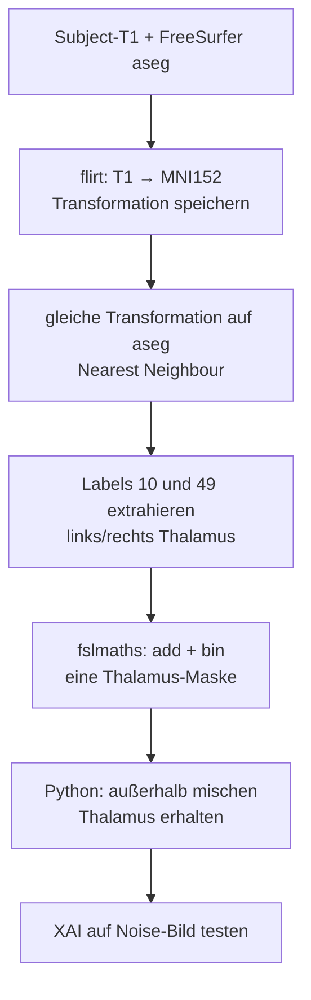
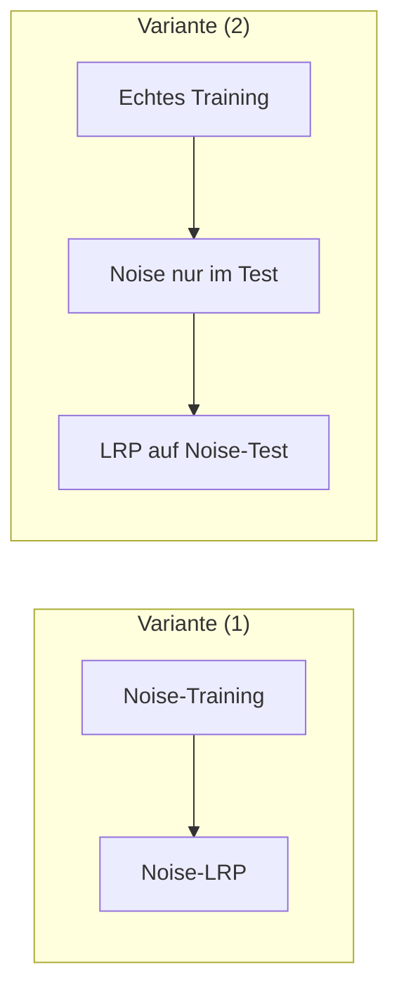

# Chat-Zusammenfassung: XAI testen mit Thalamus und Noise-Daten

Diese Notiz fasst einen Chatverlauf zusammen, in dem es um **Testdaten für Explainable AI (XAI)** auf Hirn-MRT geht. Zielgruppe: Einsteiger in Deep Learning, Neurowissenschaft und FreeSurfer.

---

## Worum geht es in einem Satz?

Man will prüfen, ob ein Deep-Learning-Modell (bzw. die XAI-Methode) wirklich auf den **Thalamus** schaut — und nicht auf irgendwelche anderen Voxel. Dafür baut man Bilder, in denen **nur der Thalamus noch „echte“ Information** enthält und der Rest des Gehirns zu Rauschen wird.

---

## Die Ausgangsfrage

Jemand arbeitet an XAI-Notebooks für Hirndaten und steht vor zwei Problemen:

1. **Einfache Testdaten fehlen.** Echte Gehirne sind komplex. Zum Debuggen braucht man kontrollierte Daten, die aber trotzdem wie 3D-Hirnbilder aussehen (NIfTI, Voxel, Masken).
2. **Voxel-Koordinaten allein sind nutzlos.** XAI sagt z. B.: „Voxel `(43, 101, 66)` war wichtig.“ Neurowissenschaftlich zählt aber die **Hirnregion** (z. B. Thalamus). Dafür braucht man einen **Atlas** / eine **Segmentierungsmaske**.

Kurz: Ohne anatomisches Label ist eine wichtige Voxel-Koordinate wissenschaftlich nicht verwertbar.

---

## Grundbegriffe für Einsteiger

| Begriff | Einfache Erklärung |
|--------|---------------------|
| **Voxel** | 3D-Pixel. Ein Hirnscan ist ein Gitter aus vielen Voxel-Intensitäten. |
| **NIfTI (`.nii` / `.nii.gz`)** | Standard-Dateiformat für MRT-Volumen. |
| **Thalamus** | Zentrale Hirnstruktur; hier die Region, auf die man XAI prüfen will. |
| **Maske** | Binäres Volumen: 1 = Voxel gehört zur Struktur, 0 = nicht. |
| **Atlas / Segmentierung** | Landkarte des Gehirns: welche Voxel gehören zu welcher Region. |
| **FreeSurfer** | Software, die u. a. Hirnstrukturen segmentiert (`aseg` = automatic segmentation). |
| **FSL** | Weiteres Toolset für MRT (Registrierung, Masken-Rechnen, Visualisierung). |
| **MNI-Raum** | Gemeinsames Koordinatensystem, damit verschiedene Gehirne vergleichbar sind. |
| **XAI** | Methoden, die zeigen, *welche Eingabe-Voxel* eine Vorhersage beeinflusst haben. |
| **Ground Truth** | Was man *weiß* richtig ist — hier: „nur im Thalamus steckt noch echte Struktur-Info“. |

---

## Die Kernidee für den XAI-Test

Statt von Null einen Würfel mit 4 künstlichen Volumina zu bauen, bleibt man im **echten Image Space** (gleiche Größe, gleiche Koordinaten wie echte Daten):

1. Nimm ein 3D-T1-Bild (z. B. in MNI152).
2. Lege eine **Thalamus-Maske** darüber.
3. Ersetze / **permutiere** alle Voxel *außerhalb* des Thalamus (z. B. mit Random Noise oder durch Shuffling der Intensitäten).
4. Der Thalamus bleibt unverändert.

**Erwartung an XAI:** Wichtige Voxel sollten **innerhalb** der Thalamus-Maske liegen. Liegen viele „wichtige“ Voxel im Noise-Bereich, stimmt etwas nicht (Modell oder Erklärung).

**Zwei Vorteile:**

- Dimensionen und Koordinaten bleiben wie bei echten Daten.
- Man weiß genau, wo die Ground Truth *nicht* liegt (überall außerhalb der Maske).

### Voxel → Region

Hat XAI Voxel `(43, 101, 66)` markiert, prüft man einfach:

> Liegt dieser Voxel in der Thalamus-Maske (`mask > 0`) oder nicht?

Das geht in Python/Matlab oder mit FSL-Tools — kein großes Extra-Projekt.

---

## Pipeline aus dem Chat (FreeSurfer + FSL)

Ziel: aus FreeSurfer-Segmentierung eine **binäre Thalamus-Maske im MNI-Raum** erzeugen (passend zum DL-Modell, das typischerweise in MNI lernt).



### Wichtige FreeSurfer-Labels

In `aseg` gilt u. a.:

- **10** = linker Thalamus  
- **49** = rechter Thalamus  

Diese Labels werden mit `fslmaths` herausgezogen, addiert und mit `-bin` zu einer Maske (0/1) gemacht.

### Warum Nearest Neighbour bei der Segmentierung?

Bei Label-Bildern darf man nicht „weich“ interpolieren — sonst entstehen Zwischenwerte wie 10.3 statt ganzer Regions-IDs. **Nearest Neighbour** hält die Label ganzzahlig.

### Typische Befehle (Idee)

1. `flirt` registriert Brainmask/T1 nach MNI152 und speichert die Matrix (`T1_to_mni152.mat`).
2. Dieselbe Matrix wird auf `aseg` angewendet.
3. Links/rechts Thalamus extrahieren und zur Gesamtmaske zusammenführen.
4. Mit `fsleyes` (oder FreeSurfer `freeview`) visuell prüfen: Maske sitzt mittig im Gehirn auf dem Thalamus.

---

## Das Python-„Shuffling“

Idee des Skripts (mit `nibabel` + `numpy`):

1. T1 und Thalamus-Maske laden (gleiche Shape).
2. `thalamus = mask > 0`
3. `shuffle_mask = außerhalb des Thalamus UND Intensität ≠ 0`  
   → Hintergrund (Luft) bleibt schwarz; die **Gehirnform** bleibt erhalten.
4. Intensitäten unter `shuffle_mask` extrahieren, **zufällig permutieren**, zurückschreiben.
5. Als neues NIfTI speichern (Affine + Header vom Original behalten).

Ergebnis: überall im Gehirn Rauschen / zerstörte Textur, **nur der Thalamus** sieht noch anatomisch aus. Genau das eignet sich als kontrollierter XAI-Test.

Cropping (Zuschneiden auf den relevanten Bereich) wurde als späterer Schritt genannt — vor allem, um den **Memory Footprint** zu verkleinern.

---

## Wie die Noise-Daten für XAI genutzt werden sollen

Offene / vorgeschlagene Strategie aus dem Chat:

- XAI oft auf **einzelnen Subjects** im **Testsample** anwenden.
- Dann reicht es, das **kleine Testset** mit Noise zu modifizieren — nicht das gesamte Trainingssample umzubauen und das Modell neu zu trainieren.
- So prüft man: Zeigt die Erklärung weiterhin auf den Thalamus, wenn der Rest des Gehirns zerstört ist?

Das ist ein Sanity-Check der Erklärbarkeit, kein Ersatz für echtes Training auf großen Kohorten.

---

## Zwei Strategien: Worauf trainieren, worauf erklären?

Zielvariable in beiden Fällen: **Thalamusvolumen** (Regression). Die Noise-Bilder (alles außer Thalamus zerstört) kommen unterschiedlich zum Einsatz.

### Variante (1) — Training *und* LRP auf synthetischen Noise-Daten

```text
1000 Subjects: Random Noise / Shuffle überall, nur Thalamus anatomisch korrekt
        → Modell trainieren (Ziel: Thalamusvolumen)
        → LRP auf denselben / gehaltenen Noise-Subjects
```

| | |
|--|--|
| **Frage, die beantwortet wird** | „Funktioniert meine LRP-Pipeline, wenn die *einzige* nutzbare Information im Thalamus steckt?“ |
| **Stärke** | Sehr kontrolliert: Wenn das Modell das Volumen lernt, *muss* es den Thalamus nutzen (sonst gibt es keine Signalquelle). Guter **Sanity-Check für XAI selbst**. |
| **Schwäche** | Das Modell lernt eine künstliche Verteilung (Noise-Gehirn). Ergebnis sagt wenig darüber, was ein Modell auf *echten* Gehirnen gelernt hat. |
| **Wann sinnvoll** | Früh: Pipeline, Metriken, LRP-Regeln debuggen, bevor man echte Daten kompliziert macht. |

### Variante (2) — Training auf echten Gehirnen, LRP auf Noise-Testdaten

```text
1000 echte Gehirne → Modell trainieren (Ziel: Thalamusvolumen)
        → später: Test-Subjects zu Noise machen (Thalamus erhalten)
        → LRP auf diesen Noise-Testbildern
```

| | |
|--|--|
| **Frage, die beantwortet wird** | „Was hat das auf *echten* Daten trainierte Modell gelernt — schaut es (laut LRP) noch auf den Thalamus, wenn der Rest zerstört ist?“ |
| **Stärke** | Wissenschaftlich näher am Ziel: echtes Lernproblem, Noise nur als **Probe** der Erklärung. Entspricht der Chat-Idee: Training nicht anfassen, nur das kleine Testsample verrauschen. |
| **Schwäche** | Weniger „wasserdicht“: Das Modell könnte auf echten Daten Hilfssignale außerhalb des Thalamus nutzen (Korrelate). Auf Noise-Bildern kann die Vorhersage und/oder die Heatmap dann „zerbrechen“ — das ist informativ, aber schwerer zu interpretieren als (1). |
| **Wann sinnvoll** | Wenn du wissen willst, ob ein **real trainiertes** Volumen-Modell anatomisch sinnvolle Features nutzt. |



### Empfehlung: Was als Nächstes?

**Kurz: erst (1) als Werkzeug-Check, dann (2) als eigentliche Aussage über das gelernte Modell.**

1. **Zuerst Variante (1)** — kleines, kontrolliertes Experiment.  
   Wenn LRP hier *nicht* klar in die Thalamus-Maske zeigt, ist die Erklärungsmethode (Regel, Preprocessing, Aggregation) noch nicht vertrauenswürdig. Dann lohnt (2) noch nicht.

2. **Danach Variante (2)** — das, was der Chat meint und was inhaltlich zählt.  
   Modell auf echten ~1000 Gehirnen für Thalamusvolumen; Noise nur auf (wenigen) Test-Subjects; LRP + Masken-Metriken (Anteil Relevanz im Thalamus, Top-k, Pointing Game, …).

**Nicht verwechseln:** Variante (1) prüft vor allem „kann LRP die einzige Signalquelle finden?“. Variante (2) prüft „nutzt mein echtes Modell den Thalamus?“. Beides ist nützlich — aber es sind **zwei verschiedene Claims**.

Praktischer Hinweis aus dem Chat: Für (2) brauchst du **nicht** 1000 Noise-Subjects zu erzeugen. Oft reichen die Testfälle; Training bleibt echt und unverrauscht.

Im Repo spiegelt sich das grob so: Permutation echter Bilder ≈ Testidee von (2); vollsynthetische Phantome / nur-Thalamus-Signal ≈ Denkweise von (1). Siehe auch `notebooks/py_files/Train_and_explain_synthetic_brain_thalamus_data.py`.

---

## Was du daraus mitnehmen solltest

1. **XAI braucht Ground Truth.** Bei Hirndaten liefert die Segmentierungsmaske diese anatomische Wahrheit.
2. **Koordinaten → Labels** über Atlas/Maske (FreeSurfer `aseg`, FSL, Python).
3. **Kontrollierte Testdaten** müssen nicht komplett künstlich sein: echte Geometrie + Noise außerhalb der ROI reicht oft besser, weil man im gleichen Raum wie das Modell bleibt.
4. **FreeSurfer** liefert die Regionen; **FSL** hilft bei Registrierung nach MNI und Masken-Ops; **Python (`nibabel`)** macht das Shuffling für den XAI-Test.
5. **Zwei Experimente, zwei Claims:** (1) Noise-Training prüft die LRP-Pipeline; (2) echtes Training + Noise-Test prüft, was das Modell auf realen Gehirnen gelernt hat. Reihenfolge sinnvoll: zuerst (1), dann (2).

---

## Bezug zum Projekt

Im Repo gibt es bereits verwandte Ideen (z. B. geometrische Dummy-Daten für LRP und IXI/FreeSurfer-Layouts). Der Chat beschreibt denselben Denkschritt für **realistischere** Hirn-Testdaten: nicht Würfel/Kugel, sondern **Thalamus erhalten, Rest shuffeln** — und dann prüfen, ob XAI die richtigen Voxel trifft.
