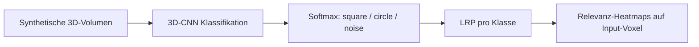

# Analyse: Train and explain dummy geometric data

Notebook: `notebooks/ipynb_files/Train_and_explain_dummy_geometric_data.ipynb`

---

## Zweck des Notebooks

Es ist eine **kontrollierte LRP-Demo**: synthetische 3D-Formen, die ein Mensch sofort versteht. So lässt sich prüfen, ob LRP wirklich die „richtigen“ Voxel hervorhebt — nicht nur, ob das Modell irgendetwas vorhersagt.

---

## Pipeline im Überblick



---

## 1. Daten rein

| | |
|--|--|
| **Shape** | `(N, 16, 16, 16, 1)` — ein Kanal, binäre/kontinuierliche Voxel |
| **Klassen** | je 200: **square** (Würfel), **circle** (Kugel), **noise** (Zufall) → 600 Samples |
| **Darstellung** | 16 Schnitte entlang Achse 0 (Slice-Visualisierung) |

Es sind **keine echten Bilder**, sondern künstliche Volumen mit bekannter Geometrie. Train/Test sind im Notebook beide `X[:300]` (Demo, kein sauberer Holdout).

### Generatoren

| Generator | Inhalt |
|-----------|--------|
| `generate_square` | gefüllter Würfel (zufällige Ecke/Kantenlänge) |
| `generate_circle` | gefüllte Kugel (Zentrum + Radius) |
| `generate_noise` | Zufallswerte in `[0, 1]` |

---

## 2. Was predicted wird

**3-Klassen-Klassifikation** (One-Hot + Softmax):

- „Ist das Volumen eher ein Würfel, eine Kugel oder Rauschen?“

Modell: kleines **3D-CNN** (Conv3D → BN → ReLU → MaxPool, 4×, dann Dense(3)).

Beispiel Mischvolumen (Composite): ca. **circle 0.58 / square 0.35 / noise 0.07** — das Modell ist unsicher, weil beide Formen vorkommen.

---

## 3. Wie LRP angewandt wird

1. **`LRPStrategy`**: Regeln je Schichttyp (`b`, α/β, ε) — steuern, wie Relevanz rückwärts verteilt wird.
2. **`layer_idx = 19`**: Erklärung startet an dieser Schicht (nahe am Ausgang), nicht zwingend am Softmax-Rohwert.
3. **Pro Klasse ein Explainer**:

   ```python
   explainers[classname] = LRP(model, layer=layer_idx, idx=i, strategy=strategy)
   ```

   `idx=i` = Relevanz für **Klassenneuron i** (square / circle / noise).
4. Dropout wird fürs Erklären auf `0.0` gesetzt (stabile Maps).
5. Output: Relevanzvolumen gleicher räumlicher Struktur wie der Input → als **seismic**-Schnitte (rot = positiv, blau = negativ).

Zusätzlich: **Composite-Inputs** (halber Würfel + halbe Kugel entlang einer Achse) — der härteste Demo-Fall.

---

## 4. Was LRP hier erklären *soll*

Nicht „die Wahrheit der Welt“, sondern:

> **Welche Input-Voxel unterstützen bzw. widersprechen der Score für Klasse C?**

Konkret im Mischbeispiel:

| Erklärung | Erwartung |
|-----------|-----------|
| **circle** | Relevanz auf den **Kugel-Schnitten** (rechte Hälfte) |
| **square** | Relevanz auf den **Würfel-Schnitten** (linke Hälfte) |
| **noise** | wenig strukturierte / schwache Relevanz |

Genau das zeigt die Demo: circle-Map auf den runden Schnitten, square-Map auf den eckigen — obwohl die Vorhersage „circle“ gewinnt.

---

## 5. Was LRP erklären *kann* — und was nicht

**Kann:**

- räumliche Attribution: welche Voxel die Klassen-Score treiben
- Plausibilitätscheck: hat das Netz Form gelernt oder Artefakte?
- Mehrdeutigkeit aufdecken: warum square *und* circle Scores haben
- Demo von Klassen-spezifischen Erklärungen (nicht nur argmax)

**Kann nicht / nur eingeschränkt:**

- kausale Garantie („ohne diese Voxel wäre nie circle“)
- Aussage über Trainingsdaten-Bias jenseits dieses Samples
- bei schlechtem Modell: „schöne“ Maps ≠ korrekte Entscheidung
- globale Regeln (nur lokales Sample)

---

## Fazit für die Demo

Das Notebook zeigt: Bei **bekannter Geometrie** und **Mischinputs** kann man LRP visuell validieren — Relevanz soll dort liegen, wo die jeweilige Form im Volumen sitzt. Genau dafür ist der Composite-Teil (Würfel+Kugel) der zentrale Beweis-Schritt der Demo.
