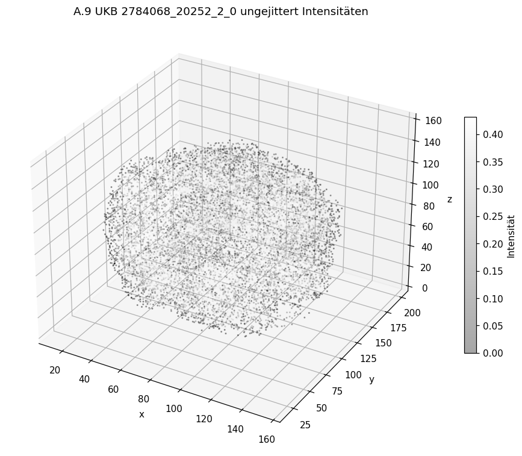
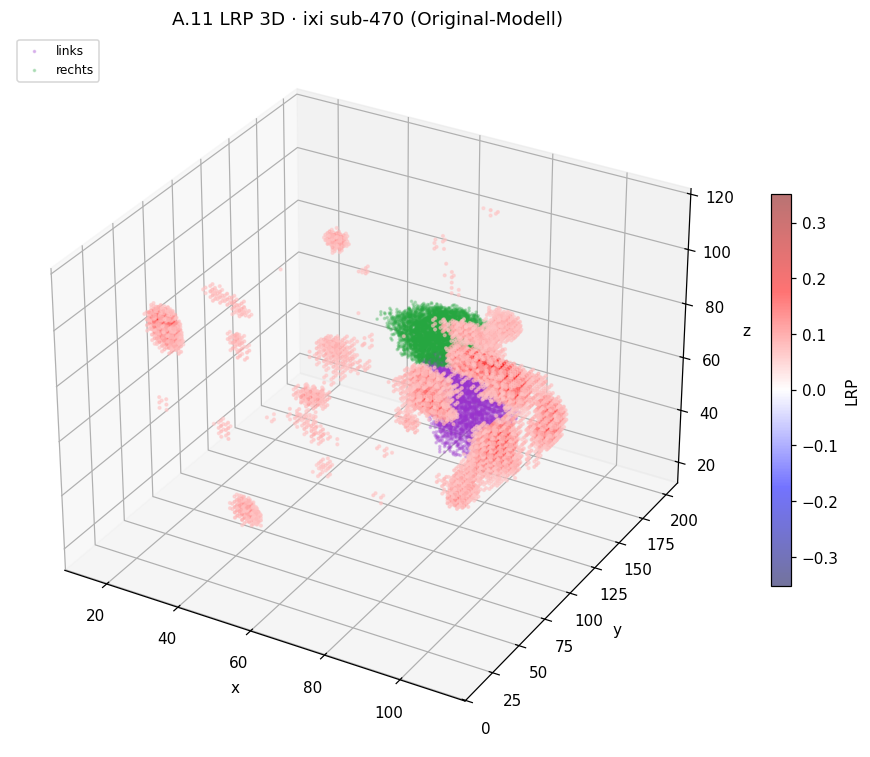
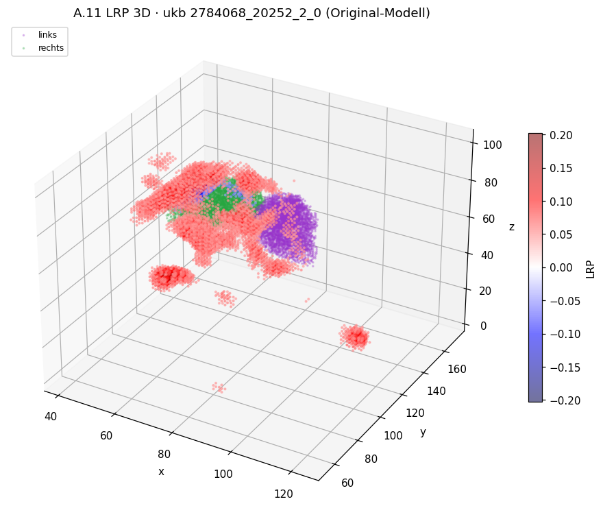
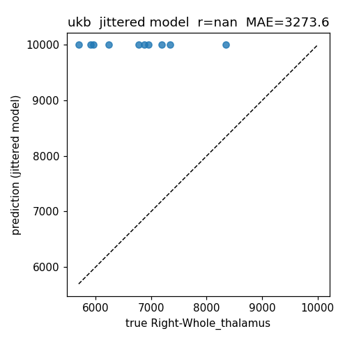
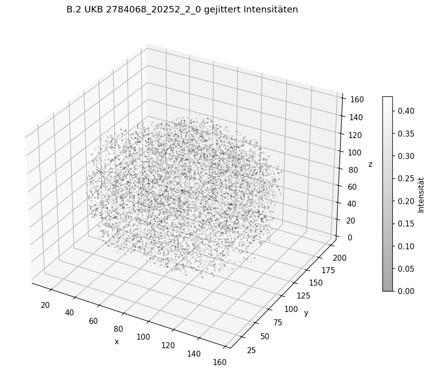
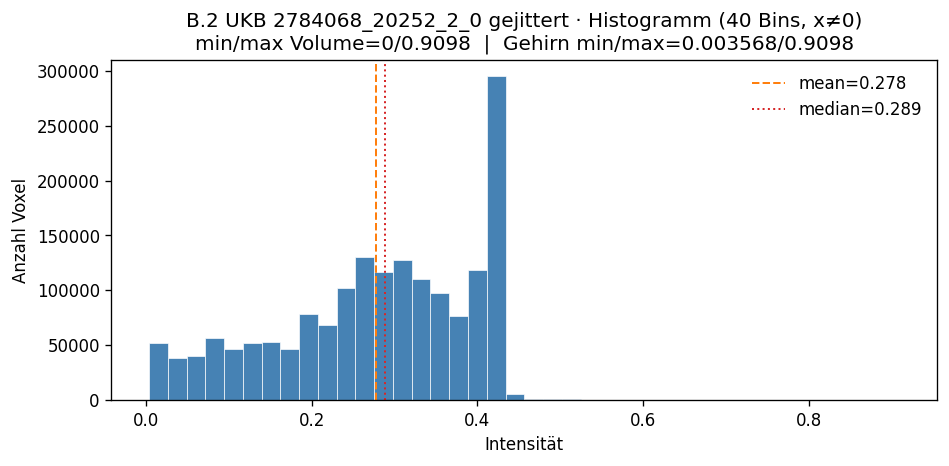
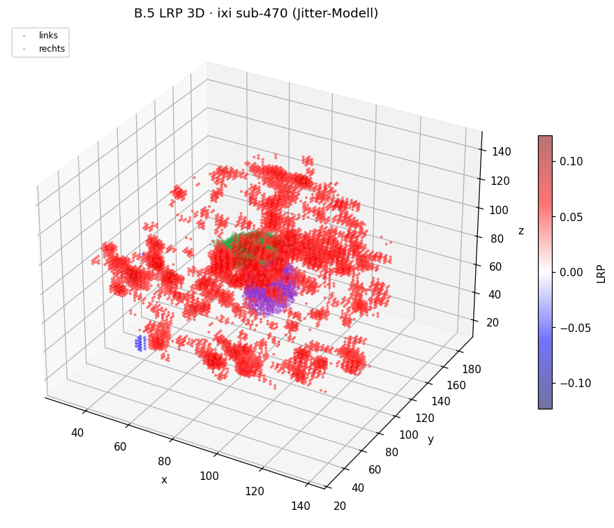
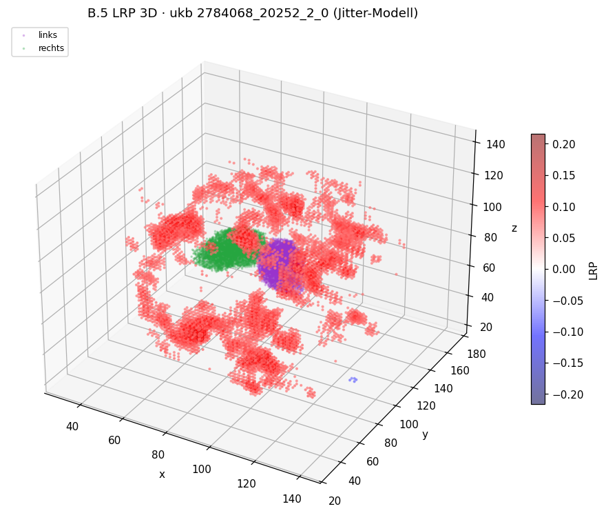

# LRP-Analyse: rechtes Thalamus-Volumen aus einem 3D-CNN


## Datenbasis und Modelle

|                     |                                                                               |
| ------------------- | ----------------------------------------------------------------------------- |
| Zielvariable        | `Right-Whole_thalamus` (mm³), Wertebereich der Config 4000–10000              |
| Architektur         | `sfcn-reg`, Input-FOV `167×212×160`, MNI152-1mm-Raum                          |
| **Original-Modell** | `~/data/nn-trainings/mri/Right-Whole_thalamus/training_run_21h19m18s_20aug2026` (auf unmanipulierten Volumes trainiert)    |
| **Jitter-Modell**   | `~/data/nn-trainings/mri/Right-Whole_thalamus/training_run_05h09m52s_04sep2026` (auf gejitterten Volumes trainiert)        |
| Datensätze          | **IXI** (n = 10) und **UKB**-Holdout aus dem offiziellen predict-Split (n = 10) |
| Traingsgröße        | jeweils 45k mit UKB Daten                                                     |


## Untersuchungsstrategien

### **Teil A: CNN rechter Thalamus Model trainiert auf UKB Daten - unverändert**

1. **Sanity Checks Training:**
   1. Scatter Plot der Prädizierten vs. wahren Rechter-Thalamus-Volumina, um zu sehen ob die Predictions überhaupt Sinn machen, also man versucht ein "funktionierendes" Model zu erklären (genommen wurden 10 Input-Subjects aus den Hold-out-Datensätzen von IXI und UKB)
   2. 3D-Intensitätsplot eines Trainingssubjects UKB, um zu sehen wie groß die typischen und min/max Intensitätswerte sind
   3. Histogram-Plot eines Trainingssubjects von UKB, um die Häufigkeit der Intensitätswerte zu sehen
2. **Sanity Checks XAI-LRP:**
   1. Heatmaps erzeugt für die ersten 2 Subjects aus dem Hold-out-Datensatz für UKB/IXI mit nicht normierten Relevanzen; linker und rechter Thalamus sind eingezeichnet zur optischen Kontrolle, ob sich die positiv + stark prädiktiven Voxel (rot) im rechten Thalamus befinden (rot = treibt die Vorhersage nach oben, blau = zieht sie nach unten). Alle 2D-Overlays nutzen dieselben festen Schnitte — sagittal `x = 70`, koronal `y = 104`, axial `z = 78`.
   2. Tabelle mit Subject-ID, wahrem Wert, Prediction für rechten Thalamus und Summe aller Relevanzen der Heatmap, um zu testen ob die LRP-Erhaltung gewährleistet ist: beim Regressionsmodell muss der geschätzte Volumenwert rückwärts über alle Layer auf die Input-Voxel verteilt werden.
   3. Interaktiver 3D-Plot der Heatmaps und Thalamus-Volumina für das erste Subject aus den Hold-out-Datensätzen für UKB/IXI, um optisch reinzoomen zu können und besser zu sehen, ob die Relevanzen einfach nur diffus verteilt sind oder irgendwie anatomisch geclustert

### **Teil B: CNN rechter Thalamus Model trainiert auf UKB Daten - alles gejittert außer rechter Thalamus**
* Die gejitterten Daten habe ich so erstellt wir wir es besprochen haben mit `flirt` und `fslmath` und der verwendung eines random number generators beim shufflen/jittern:
```python
# --- shuffle ---
rng = np.random.default_rng(seed)
values = t1[shuffle_mask].copy()
rng.shuffle(values)
```

1. **Sanity Checks Training:**
   1. Scatter Plot der Prädizierten vs. wahren Rechter-Thalamus-Volumina, um zu sehen ob die Predictions überhaupt Sinn machen, also man versucht ein "funktionierendes" Model zu erklären (genommen wurden 10 Input-Subjects aus den Hold-out-Datensätzen von IXI und UKB)
   2. 3D-Intensitätsplot eines Trainingssubjects UKB, um zu sehen wie groß die typischen und min/max Intensitätswerte sind
   3. Histogram-Plot eines Trainingssubjects von UKB, um die Häufigkeit der Intensitätswerte zu sehen
   4. Querschnittsplots von 3 UKB-Trainingssubjects, um visuell zu testen ob wirklich nur der rechte Thalamus *nicht* gejittert ist und um zu sehen in welchem Bereich die Intensitätswerte liegen, oder ob es ggf. Ausreißer durch das Jittern gab
2. **Sanity Checks XAI-LRP:**
   1. Heatmaps erzeugt für die ersten 2 Subjects aus dem Hold-out-Datensatz für UKB/IXI mit nicht normierten Relevanzen; linker und rechter Thalamus sind eingezeichnet zur optischen Kontrolle, ob sich die positiv + stark prädiktiven Voxel (rot) im rechten Thalamus befinden (rot = treibt die Vorhersage nach oben, blau = zieht sie nach unten). Alle 2D-Overlays nutzen dieselben festen Schnitte — sagittal `x = 70`, koronal `y = 104`, axial `z = 78`.
   2. Tabelle mit Subject-ID, wahrem Wert, Prediction für rechten Thalamus und Summe aller Relevanzen der Heatmap, um zu testen ob die LRP-Erhaltung gewährleistet ist: beim Regressionsmodell muss der geschätzte Volumenwert rückwärts über alle Layer auf die Input-Voxel verteilt werden.
   3. Interaktiver 3D-Plot der Heatmaps und Thalamus-Volumina für das erste Subject aus den Hold-out-Datensätzen für UKB/IXI, um optisch reinzoomen zu können und besser zu sehen, ob die Relevanzen einfach nur diffus verteilt sind oder irgendwie anatomisch geclustert


## Ergebnisse

Plots stammen aus dem Notebook
`notebooks/ipynb_files/analysis_LRP_for_right_thalamus_volume_based_on_CNN_prediction.ipynb`
(bzw. den daraus erzeugten Artefakten unter `images/` und den HTML-Dateien in diesem Ordner).
Interaktive 3D-Ansichten sind als HTML abgelegt; im Bericht steht jeweils nur ein Screenshot des interaktivenplots, aber mit deinen root-rechten könntest du da reinschauen.

### **Teil A: CNN rechter Thalamus Model trainiert auf UKB Daten - unverändert**

#### 1. Sanity Checks Training

##### 1.1 True vs. Predicted (Holdout IXI / UKB, n = 10)

| Datensatz | n  | Pearson r | MAE (mm³) |
| --------- | -- | --------- | --------- |
| IXI       | 10 | 0.953     | 280.8     |
| UKB       | 10 | 0.988     | 103.1     |


**Fazit:** Das Original-Modell liefert brauchbare Vorhersagen und eignet sich damit
grundsätzlich für eine LRP-Analyse. Auf UKB (Trainingsdatensatz) ist der Fehler klein
(MAE ≈ 103 mm³, r ≈ 0.99); auf IXI etwas größer (MAE ≈ 281 mm³) — event. ein Hinweis auf
Domain-Shift, aber keine Modell-Unbrauchbarkeit...

##### 1.2 / 1.3 Intensitäten — UKB-Holdout `2784068_20252_2_0` (ungejittertes `cropped.nii.gz`)

Gesamtes Volume: **min = 0**, **max ≈ 0.910**. Anteil Hintergrund (`x == 0`): typisch ~65 %.



Interaktive 3D-Ansicht:
[`a09_intensity_3d_ukb_2784068.html`](a09_intensity_3d_ukb_2784068.html)


**Fazit:** Die Intensitäten liegen in einem engen, positiven Bereich ohne offensichtliche
Ausreißer. Der Hintergrund ist sauber genullt; das Histogramm der Gehirnvoxel ist
mono-modal und für T1-Cropped-Daten plausibel. Damit ist die Input-Skala für Teil A
unauffällig.

#### 2. Sanity Checks XAI-LRP

##### 2.1 2D-LRP-Overlays (unnormiert; Thalamus links lila / rechts grün)

Schnitte fest: sagittal `x = 70`, koronal `y = 104`, axial `z = 78`.


**Fazit:** Positive Relevanz (rot) liegt teilweise auf/neben dem rechten Thalamus, ist
aber in allen Fällen auch weit über Kortex und Gehirnrand verteilt. Der rechte Thalamus
dominiert die Heatmap optisch nicht systematisch, dh das vermutlich nur irgendwelche Korrelationen vom Model gelernt worden sind aber nichts wirklich nur ausschließlich "gehaltvolles" anatomisches wissen.

##### 2.2 Relevanzerhaltung: `pred` vs. ΣR (Heatmaps unmaskiert)

| Datensatz | Subject           | true   | pred   | ΣR     | %\|R\| links | %\|R\| **rechts** | %\|R\| außerhalb |
| --------- | ----------------- | ------ | ------ | ------ | ---------- | --------------- | -------------- |
| IXI       | sub-470           | 8284.3 | 8156.9 | 8214.9 | 2.41       | **0.52**        | 97.08          |
| IXI       | sub-634           | 8502.8 | 8191.4 | 8248.5 | 1.06       | **3.12**        | 95.82          |
| UKB       | 2784068_20252_2_0 | 6872.5 | 6926.2 | 6972.7 | 0.70       | **1.66**        | 97.64          |
| UKB       | 1877470_20252_2_0 | 7339.3 | 7266.5 | 7316.0 | 0.60       | **3.50**        | 95.90          |

Über alle 10+10 Fälle: mittleres Verhältnis **ΣR / pred ≈ 1.007** (nahe 100 %).
Anteil \|R\| im rechten Thalamus typisch nur **~1–3.5 %**; außerhalb beider Thalami
**~95–99 %**.

**Fazit:** Die LRP-Erhaltung ist numerisch in Ordnung, da die Relevanz über alle Layer erhalten bleibt (ΣR ≈ pred), also wird das Thalamus Volumen korrekt zurück propagiert und auf die Voxel verteilt. Inhaltlich spricht
der sehr kleine Anteil im rechten Thalamus dagegen, dass das Modell seine Vorhersage
primär aus dieser Struktur bezieht — trotz guter Vorhersagequalität in 1.1.

##### 2.3 3D-LRP (Original-Modell) — Screenshot + interaktives HTML



Interaktiv: [`ixi_sub-470_thalamus_lrp_3d.html`](ixi_sub-470_thalamus_lrp_3d.html)



Interaktiv: [`ukb_2784068_20252_2_0_thalamus_lrp_3d.html`](ukb_2784068_20252_2_0_thalamus_lrp_3d.html)

**Fazit:** Auch in 3D ist die Relevanz räumlich diffus und nicht klar als Thalamus-Cluster
abgrenzbar. Das bestätigt den 2D-/Tabellen-Eindruck aus 2.1 und 2.2.

---

### **Teil B: CNN rechter Thalamus Model trainiert auf UKB Daten - alles gejittert außer rechter Thalamus**

#### 1. Sanity Checks Training

##### 1.1 True vs. Predicted — Jitter-trainiertes Modell (UKB-Holdout)



In Teil C liefert dasselbe Modell auf originalen Holdout-Volumes für IXI und UKB die
Vorhersage **10000.0** (Config-Obergrenze).

**Fazit:** Das auf gejitterten Volumes trainierte Modell ist als Erklärungsgegenstand
nicht brauchbar (Sättigung / fehlende Generalisierung auf originale Inputs). Der kausale
Test unten nutzt deshalb das **Original-Modell** auf gejitterten Inputs.

##### 1.2 / 1.3 Intensitäten — dasselbe Subject, gejittertes Volume

Datei:
`.../jittered_data/ukb/recon/2784068_20252_2_0/mri/T1_mni152_right_thalamus_preserved_others_shuffled.nii.gz`  
min/max weiterhin **0 / ≈ 0.910** (Intensitätsverteilung global ähnlich, Struktur außerhalb
des Thalamus zerstört).



Interaktiv: [`b02_intensity_3d_ukb_2784068_jittered.html`](b02_intensity_3d_ukb_2784068_jittered.html)



**Fazit:** Jittern ändert die Intensitäts-*Histogrammform* kaum (erwartete Folge einer
Permutation?), zerstört aber die räumliche Struktur — sichtbar im 3D-Plot als „Rauschen“
außerhalb des erhaltenen Thalamus.

##### 1.4 Querschnitts-QC (Nicht-Holdout): rechter Thalamus erhalten?

| Subject           | r innerhalb Maske | r außerhalb |
| ----------------- | ----------------- | ----------- |
| 1590956_20252_2_0 | 1.000             | ≈ 0         |
| 3025817_20252_2_0 | 1.000             | ≈ 0         |
| 3442544_20252_2_0 | 1.000             | ≈ 0         |


**Fazit:** Die Daten-Manipulation hat funktioniert wie besprochen: Thalamus-Korrelation = 1,
außerhalb ≈ 0. Abweichungen in den LRP-/Pred-Tests können nicht auf fehlerhaftes Jittern
geschoben werden.

#### 2. Sanity Checks XAI-LRP

##### 2.1 LRP-Overlays — Original-Modell auf gejitterten UKB-Holdout-Volumes

| Subject           | pred original | pred gejittert | Δ pred      |
| ----------------- | ------------- | -------------- | ----------- |
| 2784068_20252_2_0 | 6926          | 7628           | **+702**    |
| 1877470_20252_2_0 | 7266          | 7511           | **+245**    |
| 5614724_20252_2_0 | 7044          | 7626           | **+582**    |
| 5820487_20252_2_0 | 5901          | 7064           | **+1163**   |


**Fazit:** Bei anatomisch unverändertem rechten Thalamus verschiebt sich die Vorhersage
stark (Mittel ≈ **+670 mm³**, systematisch nach oben) — weit über dem normalen UKB-MAE.
Die Heatmaps konzentrieren sich nicht stärker auf den Thalamus, sondern oft auf den
Gehirnrand. Das Umfeld ist für die Vorhersage **notwendig**; der Thalamus allein reicht
nicht.

##### 2.2 Relevanzerhaltung / Bilanz

Für das Original-Modell gilt weiterhin ΣR ≈ pred (Teil A / Teil C, ~100 %). Das
Jitter-Modell saturiert bei f(x) = 10000 und ist als Modellvergleich
nicht aussagekräftig.

**Fazit:** LRP-Erhaltung gilt auch beim gejitterten Model, also XAI-LRP klappt, aber die idee „Modell lernt nur rechten Thalamus“ wenn umgebung "zerstört" wird, wird durch die Pred-Verschiebung unter Jitter nicht erfüllt.

##### 2.3 3D-LRP — Jitter-Modell auf originalen Volumes (Screenshot + HTML)



Interaktiv: [`ixi_sub-470_thalamus_lrp_3d_jitter_model.html`](ixi_sub-470_thalamus_lrp_3d_jitter_model.html)



Interaktiv: [`ukb_2784068_20252_2_0_thalamus_lrp_3d_jitter_model.html`](ukb_2784068_20252_2_0_thalamus_lrp_3d_jitter_model.html)

**Fazit:** Beim gesättigten Jitter-Modell ist die Relevanz räumlich ebenfalls nicht als
saubere Thalamus-Lokalisation interpretierbar; der 3D-Blick stützt nicht die Idee eines
thalamus-spezifischen Erklärungsmodells.
