# LRP-Analyse: rechtes Thalamus-Volumen aus einem 3D-CNN


## Datenbasis und Modelle

|                     |                                                                               |
| ------------------- | ----------------------------------------------------------------------------- |
| Zielvariable        | `Right-Whole_thalamus` (mm³), Wertebereich der Config 4000–10000              |
| Architektur         | `sfcn-reg`, Input-FOV `167×212×160`, MNI152-1mm-Raum                          |
| **Original-Modell** | `~/data/nn-trainings/mri/Right-Whole_thalamus/training_run_21h19m18s_20aug2026` (auf unmanipulierten Volumes trainiert)    |
| **Jitter-Modell**   | `~/data/nn-trainings/mri/Right-Whole_thalamus/training_run_05h09m52s_04sep2026` (auf gejitterten Volumes trainiert)        |
| Datensätze          | **IXI** (n = 10) und **UKB**-Holdout aus dem offiziellen predict-Split (n = 10) |
| Traingsgröße        | jeweils 45k mit UKB Daten                                                     |


## Untersuchungsstrategien

### **Teil A: CNN rechter Thalamus Model trainiert auf UKB Daten - unverändert**

1. **Sanity Checks Training:**
   1. Scatter Plot der Prädizierten vs. wahren Rechter-Thalamus-Volumina, um zu sehen ob die Predictions überhaupt Sinn machen, also man versucht ein "funktionierendes" Model zu erklären (genommen wurden 10 Input-Subjects aus den Hold-out-Datensätzen von IXI und UKB)
   2. 3D-Intensitätsplot eines Trainingssubjects UKB, um zu sehen wie groß die typischen und min/max Intensitätswerte sind
   3. Histogram-Plot eines Trainingssubjects von UKB, um die Häufigkeit der Intensitätswerte zu sehen
2. **Sanity Checks XAI-LRP:**
   1. Heatmaps erzeugt für die ersten 2 Subjects aus dem Hold-out-Datensatz für UKB/IXI mit nicht normierten Relevanzen; linker und rechter Thalamus sind eingezeichnet zur optischen Kontrolle, ob sich die positiv + stark prädiktiven Voxel (rot) im rechten Thalamus befinden (rot = treibt die Vorhersage nach oben, blau = zieht sie nach unten). Alle 2D-Overlays nutzen dieselben festen Schnitte — sagittal `x = 70`, koronal `y = 104`, axial `z = 78`.
   2. Tabelle mit Subject-ID, wahrem Wert, Prediction für rechten Thalamus und Summe aller Relevanzen der Heatmap, um zu testen ob die LRP-Erhaltung gewährleistet ist: beim Regressionsmodell muss der geschätzte Volumenwert rückwärts über alle Layer auf die Input-Voxel verteilt werden.
   3. Interaktiver 3D-Plot der Heatmaps und Thalamus-Volumina für das erste Subject aus den Hold-out-Datensätzen für UKB/IXI, um optisch reinzoomen zu können und besser zu sehen, ob die Relevanzen einfach nur diffus verteilt sind oder irgendwie anatomisch geclustert

### **Teil B: CNN rechter Thalamus Model trainiert auf UKB Daten - alles gejittert außer rechter Thalamus**

1. **Sanity Checks Training:**
   1. Scatter Plot der Prädizierten vs. wahren Rechter-Thalamus-Volumina, um zu sehen ob die Predictions überhaupt Sinn machen, also man versucht ein "funktionierendes" Model zu erklären (genommen wurden 10 Input-Subjects aus den Hold-out-Datensätzen von IXI und UKB)
   2. 3D-Intensitätsplot eines Trainingssubjects UKB, um zu sehen wie groß die typischen und min/max Intensitätswerte sind
   3. Histogram-Plot eines Trainingssubjects von UKB, um die Häufigkeit der Intensitätswerte zu sehen
   4. Querschnittsplots von 3 UKB-Trainingssubjects, um visuell zu testen ob wirklich nur der rechte Thalamus *nicht* gejittert ist und um zu sehen in welchem Bereich die Intensitätswerte liegen, oder ob es ggf. Ausreißer durch das Jittern gab
2. **Sanity Checks XAI-LRP:**
   1. Heatmaps erzeugt für die ersten 2 Subjects aus dem Hold-out-Datensatz für UKB/IXI mit nicht normierten Relevanzen; linker und rechter Thalamus sind eingezeichnet zur optischen Kontrolle, ob sich die positiv + stark prädiktiven Voxel (rot) im rechten Thalamus befinden (rot = treibt die Vorhersage nach oben, blau = zieht sie nach unten). Alle 2D-Overlays nutzen dieselben festen Schnitte — sagittal `x = 70`, koronal `y = 104`, axial `z = 78`.
   2. Tabelle mit Subject-ID, wahrem Wert, Prediction für rechten Thalamus und Summe aller Relevanzen der Heatmap, um zu testen ob die LRP-Erhaltung gewährleistet ist: beim Regressionsmodell muss der geschätzte Volumenwert rückwärts über alle Layer auf die Input-Voxel verteilt werden.
   3. Interaktiver 3D-Plot der Heatmaps und Thalamus-Volumina für das erste Subject aus den Hold-out-Datensätzen für UKB/IXI, um optisch reinzoomen zu können und besser zu sehen, ob die Relevanzen einfach nur diffus verteilt sind oder irgendwie anatomisch geclustert


### 1.4 Methodisches Vorgehen

**LRP-Composite-Strategie** (vom Ausgang zum Eingang):


| Position im Netz              | Regel               |
| ----------------------------- | ------------------- |
| Dense-Ausgang (`predictions`) | ε = 0.25            |
| vier mittlere Conv-Blöcke     | αβ mit α = 2, β = 1 |
| zwei eingangsnahe Conv-Blöcke | `flat`              |
| MaxPooling                    | Winner-takes-all    |
| Global Average Pooling        | Redistribute        |


Insgesamt umfasst der Rückwärtspfad 59 LRP-Schichten.

**Anatomische Referenz:** Die Thalamus-Masken stammen aus der FreeSurfer-`aseg`
(Label 10 = links, Label 49 = rechts), werden per `flirt` nach MNI152 registriert und auf
das Training-FOV `167×212×160` zugeschnitten.

**Nachbearbeitung der Heatmaps:** `mask_explanation()` setzt die Relevanz auf allen
Hintergrundvoxeln (`Voxelwert == 0`) auf Null. Die gespeicherten Heatmaps enthalten also
die Relevanz **im Gehirn**, nicht die Gesamtrelevanz.

**Darstellung:** Alle 2D-Overlays nutzen dieselben festen Schnitte — sagittal `x = 70`,
koronal `y = 104`, axial `z = 78`. Die LRP-Werte sind **unnormiert** (rot = treibt die
Vorhersage nach oben, blau = zieht sie nach unten). Der rechte Thalamus ist grün, der
linke lila markiert.

---


## 2. Teil A — CNN rechter Thalamus Model trainiert auf UKB Daten - unverändert


### 2.1 Vorhersagequalität

**Ziel:** Sicherstellen, dass überhaupt ein funktionierendes Modell erklärt wird. Eine
Erklärung eines schlecht vorhersagenden Modells wäre wertlos. Ausgewertet werden Pearson-r
und MAE auf den Holdout-Fällen.


| Datensatz | n   | Pearson r | MAE (mm³) |
| --------- | --- | --------- | --------- |
| IXI       | 5   | 0.988     | 354.1     |
| UKB       | 5   | 0.995     | 53.7      |


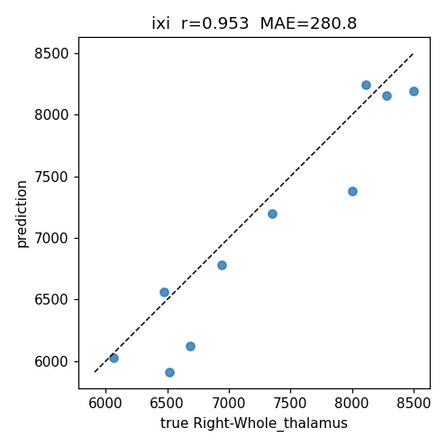

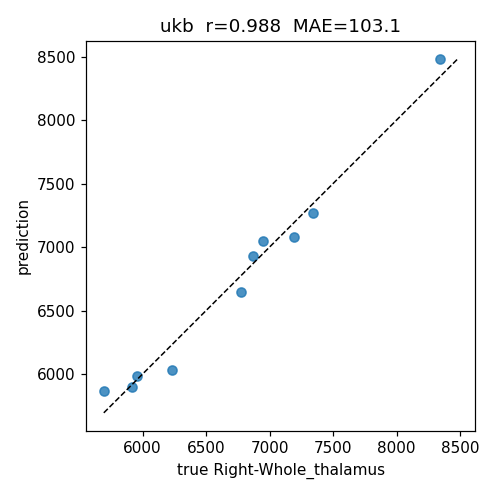

Einzelwerte:


| Datensatz | Subject           | true (mm³) | pred (mm³) |
| --------- | ----------------- | ---------- | ---------- |
| IXI       | sub-470           | 8284.3     | 8156.9     |
| IXI       | sub-634           | 8502.8     | 8191.4     |
| IXI       | sub-109           | 6943.5     | 6783.2     |
| IXI       | sub-490           | 6518.0     | 5910.2     |
| IXI       | sub-376           | 6687.1     | 6123.7     |
| UKB       | 2784068_20252_2_0 | 6872.5     | 6926.2     |
| UKB       | 1877470_20252_2_0 | 7339.3     | 7266.5     |
| UKB       | 5614724_20252_2_0 | 6945.7     | 7044.0     |
| UKB       | 5820487_20252_2_0 | 5915.0     | 5900.7     |
| UKB       | 2671605_20252_2_0 | 5954.4     | 5983.5     |


**Befund:** Das Modell funktioniert. Auf UKB — dem Datensatz, auf dem trainiert wurde —
ist der Fehler mit 53.7 mm³ sehr klein. Auf IXI ist der Fehler rund siebenmal größer
(354.1 mm³) und systematisch: Alle fünf IXI-Vorhersagen liegen **unter** dem wahren Wert.
Das deutet ggf. auf einen Domain-Shift zwischen den Datensätzen hin (Scanner, Sequenz,
Vorverarbeitung). Die MAE-Differenz ist der Bezugsmaßstab für Teil B.

### 2.2 LRP-Heatmaps

**Ziel:** Die visuelle Inspektion der Relevanzverteilung. Bevor Prozentzahlen berechnet
werden, soll der Augenschein zeigen, ob die Relevanz überhaupt in der Nähe des Thalamus
konzentriert ist oder diffus über das Gehirn verteilt liegt.

Für die ersten zwei Fälle je Datensatz wurden Overlay-Plots erzeugt:

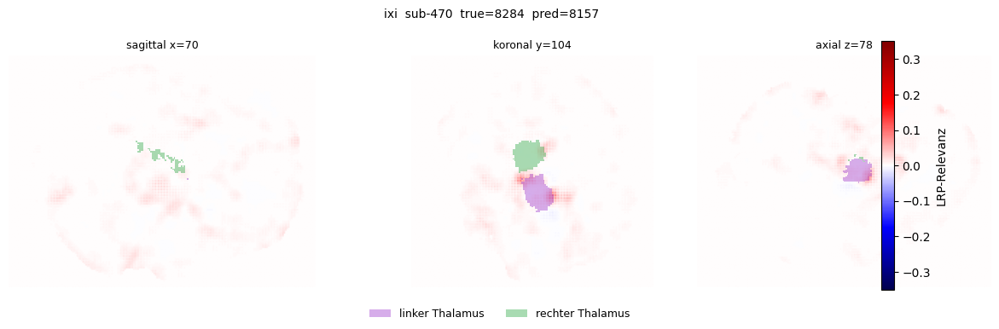

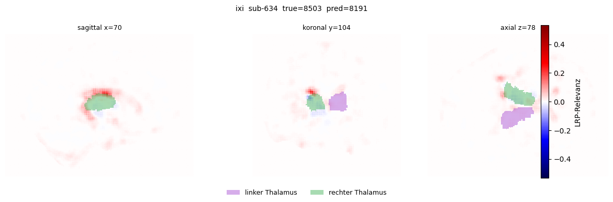

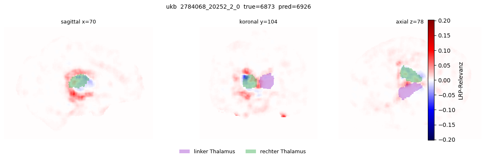

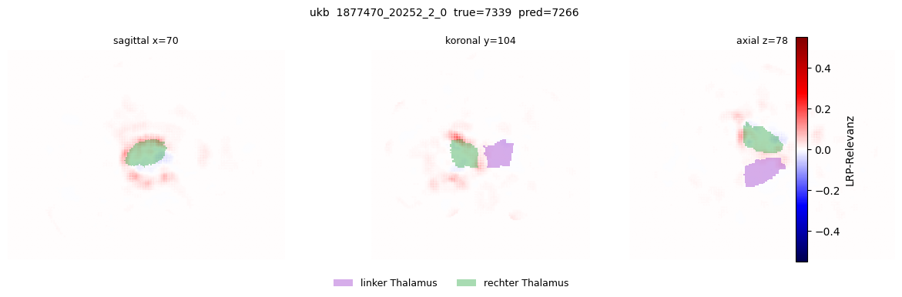

Für alle 10 Fälle wurden Heatmaps als NIfTI gespeichert, ohne Fehler bei der
Maskenerzeugung.

**Befund:** Das Bild ist gemischt. Bei `sub-634`, `2784068` und `1877470` gibt es eine
deutlich sichtbare Relevanzkonzentration direkt auf und um die grüne rechte
Thalamus-Maske — teils mit einem charakteristischen roten Ring um die Maske und blauen
(negativen) Anteilen innerhalb. Das entspricht dem, was man von einem Netz erwartet, das
eine Struktur *abgrenzt*: Die Randvoxel tragen die Information über die Ausdehnung.
Gleichzeitig ist aber in allen Fällen erhebliche Relevanz über den gesamten Kortex und
den Gehirnrand verteilt. Bei `sub-470` ist der Thalamus visuell kaum hervorgehoben.

### 2.3 Relevanzanteil im Thalamus

**Ziel:** Den visuellen Eindruck in eine Zahl übersetzen. Gemessen wird der
Anteil der |LRP|-Summe innerhalb der linken und rechten Thalamus-Maske gegen den Rest des
Gehirns. Das ist die zentrale quantitative Auswertung von Teil A.


| Datensatz | Subject | pred   | ΣR     | Σ|R|   | %|R| links | %|R| **rechts** | %|R| außerhalb | Voxel ≠ 0 |
| --------- | ------- | ------ | ------ | ------ | ---------- | --------------- | -------------- | --------- |
| IXI       | sub-470 | 8156.9 | 5833.5 | 5966.7 | 3.39       | **0.73**        | 95.89          | 2 007 343 |
| IXI       | sub-634 | 8191.4 | 6154.7 | 6574.5 | 1.41       | **4.15**        | 94.44          | 1 836 731 |
| IXI       | sub-109 | 6783.2 | 4842.3 | 5177.2 | 1.31       | **2.78**        | 95.91          | 1 616 241 |
| IXI       | sub-490 | 5910.2 | 3711.9 | 3980.1 | 0.59       | **2.67**        | 96.74          | 1 560 432 |
| IXI       | sub-376 | 6123.7 | 3897.8 | 4092.9 | 0.58       | **1.76**        | 97.65          | 1 558 047 |
| UKB       | 2784068 | 6926.2 | 4786.6 | 5082.5 | 1.02       | **2.40**        | 96.58          | 1 711 483 |
| UKB       | 1877470 | 7266.5 | 5081.9 | 5312.2 | 0.86       | **5.03**        | 94.11          | 1 802 695 |
| UKB       | 5614724 | 7044.0 | 4753.6 | 5017.1 | 0.74       | **1.65**        | 97.61          | 1 724 318 |
| UKB       | 5820487 | 5900.7 | 3541.5 | 3757.4 | 0.43       | **1.23**        | 98.34          | 1 492 733 |
| UKB       | 2671605 | 5983.5 | 3935.3 | 4182.6 | 0.34       | **1.61**        | 98.05          | 1 387 775 |


Die Prozentangaben beziehen sich auf die **Gehirn**-Relevanz Σ|R|, also die für die
Thalamus-Frage passende Normierung.

#### Warum ΣR kleiner ist als die Vorhersage

Über alle 10 Fälle liegt ΣR bei durchschnittlich **67.7 %** der Vorhersage (Spanne
60.0–75.1 %). Der fehlende Drittelanteil ist kein Erhaltungsfehler, sondern die
Maskierung: Relevanz auf Hintergrundvoxeln außerhalb des Gehirns wird verworfen.

Dass überhaupt nennenswert Relevanz im Hintergrund landet, ist eine direkte Folge der
`flat`**-Regel** der beiden eingangsnahen Conv-Schichten. Bei αβ und ε ist die Relevanz
eines Voxels proportional zu seiner Aktivierung — ein Voxel mit `x = 0` bekommt zwingend
`R = 0`. Die `flat`-Regel setzt dagegen `a ← 1` und verteilt gleichmäßig über das
rezeptive Feld, unabhängig vom Voxelwert, also auch in die Luft um den Kopf. Teil C
bestätigt, dass die Relevanz über den gesamten Rückwärtspfad erhalten bleibt.

#### Einordnung: Relevanzdichte statt Rohanteil

Ein Rohanteil von 0.7–5.0 % klingt zunächst nach einer Widerlegung der Hypothese. Der
Wert muss aber gegen die **Größe** des Thalamus normiert werden: Der rechte Thalamus
umfasst nur etwa 0.4 % der Gehirnvoxel. Ein Modell, das gar nicht auf den Thalamus
schaut, würde dort also rund 0.4 % der Relevanz zuweisen.

Die folgende Anreicherung (Relevanzanteil geteilt durch Voxelanteil) ist **aus der
Tabelle oben abgeleitet und nicht Teil der Notebook-Ausgabe**. Der Voxelanteil wird dabei
über das wahre Thalamus-Volumen in mm³ bei 1-mm-Isotropie genähert:


| Datensatz | Subject | Voxelanteil rechter Thalamus | %|R| rechts | **Anreicherung** |
| --------- | ------- | ---------------------------- | ----------- | ---------------- |
| IXI       | sub-470 | 0.41 %                       | 0.73 %      | 1.8×             |
| IXI       | sub-634 | 0.46 %                       | 4.15 %      | 9.0×             |
| IXI       | sub-109 | 0.43 %                       | 2.78 %      | 6.5×             |
| IXI       | sub-490 | 0.42 %                       | 2.67 %      | 6.4×             |
| IXI       | sub-376 | 0.43 %                       | 1.76 %      | 4.1×             |
| UKB       | 2784068 | 0.40 %                       | 2.40 %      | 6.0×             |
| UKB       | 1877470 | 0.41 %                       | 5.03 %      | 12.4×            |
| UKB       | 5614724 | 0.40 %                       | 1.65 %      | 4.1×             |
| UKB       | 5820487 | 0.40 %                       | 1.23 %      | 3.1×             |
| UKB       | 2671605 | 0.43 %                       | 1.61 %      | 3.7×             |


Median 5.1×, Mittelwert 5.7×, Spanne 1.8–12.4×.

**Befund:** Der rechte Thalamus ist gegenüber dem Zufall klar angereichert — das Modell
schaut also nachweislich dorthin. Aber die Anreicherung ist weder besonders stark noch
stabil: Sie schwankt um den Faktor 7 zwischen den Fällen, und bei `sub-470` ist sie mit
1.8× praktisch nicht von Zufall zu unterscheiden. Zudem liegen auch nach der Normierung
94–98 % der Relevanz außerhalb beider Thalami. Auffällig ist außerdem, dass bei `sub-470`
der **linke** Thalamus mehr Relevanz erhält (3.39 %) als der rechte (0.73 %) — obwohl
allein das rechte Volumen vorhergesagt werden soll.

Teil A stützt die Hypothese also nur teilweise: Der Thalamus ist beteiligt, dominiert
aber nicht.

### 2.4 Interaktiver 3D-Plot (Abschnitt A.10)

**Ziel:** Ein frei drehbarer
3D-Plot, ob die Relevanz den Thalamus tatsächlich umschließt.

Dargestellt werden Gehirnkontur, beide FreeSurfer-Thalamus-Masken und die unnormierte
LRP-Heatmap (nur die Voxel mit dem größten |R|, sonst wären es rund 2 Mio. Punkte).
Erzeugt für das jeweils erste Subject:

- IXI `sub-470` → `[ixi_sub-470_thalamus_lrp_3d.html](../../../output/notebooks/analysis_LRP_for_right_thalamus_volume_based_on_CNN_prediction/ixi_sub-470_thalamus_lrp_3d.html)`
- UKB `2784068_20252_2_0` → `[ukb_2784068_20252_2_0_thalamus_lrp_3d.html](../../../output/notebooks/analysis_LRP_for_right_thalamus_volume_based_on_CNN_prediction/ukb_2784068_20252_2_0_thalamus_lrp_3d.html)`

Die Dateien sind interaktiv (drehen, zoomen, verschieben) und ließen sich daher nicht als
PNG in diesen Bericht einbetten.

---


## 3. Teil B — Jitter-Framework als kausaler Test

**Ziel dieses Teils:** Teil A kann nur zeigen, wohin LRP Relevanz zuweist. Ob das Umfeld
für die Vorhersage tatsächlich **notwendig** ist, lässt sich nur durch Eingriff
feststellen. Dazu wird der rechte Thalamus im Volumen unverändert gelassen und das
restliche Gehirn voxelweise permutiert ("shuffled"):

```
/mnt/users/andreasre/data/jittered_data/ukb/recon/<subject-id>/mri/
    T1_mni152_right_thalamus_preserved_others_shuffled.nii.gz
```

Die Permutation zerstört jede räumliche Struktur außerhalb des Thalamus, erhält aber die
Intensitäts-Verteilung. **Erwartung, wenn das Modell wirklich nur das rechte
Thalamus-Volumen liest:** Die Vorhersage bleibt stabil und der Relevanzanteil im rechten
Thalamus steigt, weil das Umfeld keine nutzbare Struktur mehr trägt.

Teil B existiert nur für UKB, da nur dieser Datensatz gejittert vorliegt.

> **Hinweis zur Datenlage:** Die Code-Zellen von Teil B tragen im gespeicherten Notebook
> **keine Ausgaben** — die Zellen wurden nach dem letzten vollständigen Lauf nicht erneut
> ausgeführt. Die hier gezeigten Ergebnisse stammen aus den auf der Platte abgelegten
> PNG-Dateien; die Kennzahlen sind aus den Plot-Titeln übernommen. Die zusammenfassenden
> Tabellen von B.1 und B.3 (Pearson-r, MAE, mittlere Vorhersageverschiebung) liegen nicht
> vor und sind unten entsprechend gekennzeichnet.


### 3.1 QC der gejitterten Volumes (Abschnitt B.2)

**Ziel:** Bevor aus der Manipulation Schlüsse gezogen werden, muss geprüft werden, dass
die Manipulation das tut, was sie soll. Der Test verlangt zwei Dinge gleichzeitig: Der
rechte Thalamus muss **exakt erhalten** sein, das übrige Gehirn muss **vollständig
dekorreliert** sein. Gemessen wird dazu Pearson-r zwischen Original- und gejittertem
Volumen, getrennt innerhalb und außerhalb der Maske.

Die drei geprüften Fälle wurden mit festem Seed **zufällig gezogen** und stammen
bewusst **nicht** aus dem Holdout-Split — dieser bleibt Abschnitt B.3 vorbehalten.


| Subject           | r innerhalb Maske | r außerhalb |
| ----------------- | ----------------- | ----------- |
| 1590956_20252_2_0 | 1.000             | −0.001      |
| 3025817_20252_2_0 | 1.000             | 0.001       |
| 3442544_20252_2_0 | 1.000             | −0.000      |


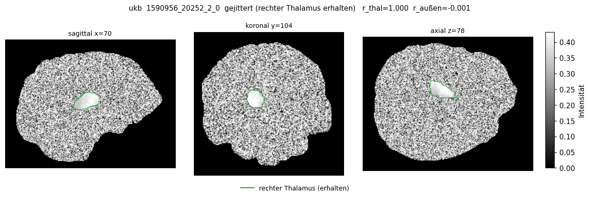

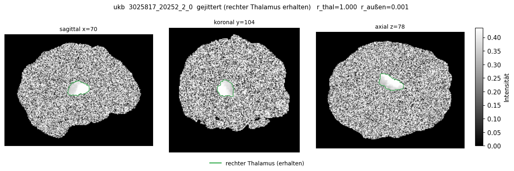

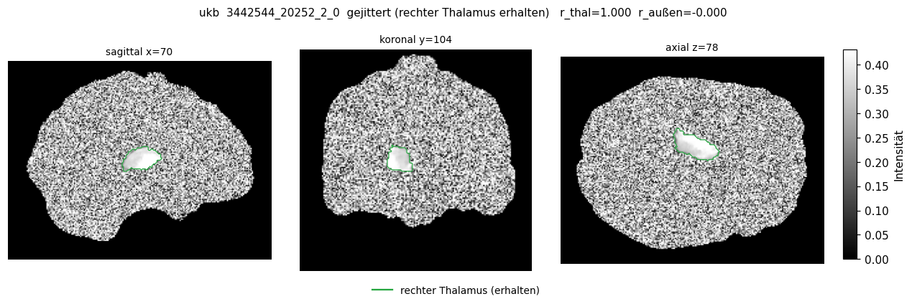

**Befund:** Das Jitter-Framework arbeitet exakt wie spezifiziert. Innerhalb der Maske ist
die Korrelation perfekt (r = 1.000), außerhalb vollständig verschwunden (|r| ≤ 0.001).
In den Bildern ist der erhaltene Thalamus als einzige zusammenhängende Struktur im
ansonsten reinen Rauschen klar erkennbar. Die Manipulation ist damit als Werkzeug
validiert, und Abweichungen in B.3 können nicht auf einen fehlerhaften Eingriff
geschoben werden.

### 3.2 Original-Modell auf gejitterten Volumes (Abschnitt B.3)

**Ziel:** Der eigentliche kausale Test. Das **Original-Modell** aus Teil A — unverändert,
ohne Nachtraining — wird auf die gejitterten Volumes derselben UKB-Holdout-Fälle
angewendet. Verglichen wird die Vorhersage auf dem manipulierten Volumen gegen die
Vorhersage auf dem unmanipulierten Volumen aus A.7.


| Subject           | true | pred original | pred gejittert | Verschiebung        |
| ----------------- | ---- | ------------- | -------------- | ------------------- |
| 2784068_20252_2_0 | 6873 | 6926          | 7628           | **+702** (+10.1 %)  |
| 1877470_20252_2_0 | 7339 | 7266          | 7511           | **+245** (+3.4 %)   |
| 5614724_20252_2_0 | 6946 | 7044          | 7626           | **+582** (+8.3 %)   |
| 5820487_20252_2_0 | 5915 | 5901          | 7064           | **+1163** (+19.7 %) |


Für den fünften Holdout-Fall (`2671605_20252_2_0`) liegt keine Ausgabe vor; die
Jitter-Datei fehlt offenbar und wurde übersprungen.

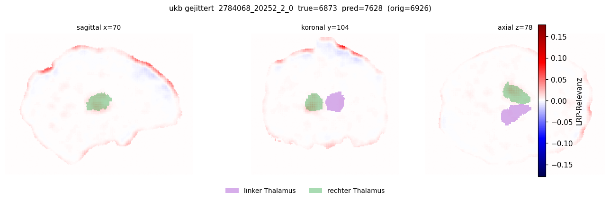

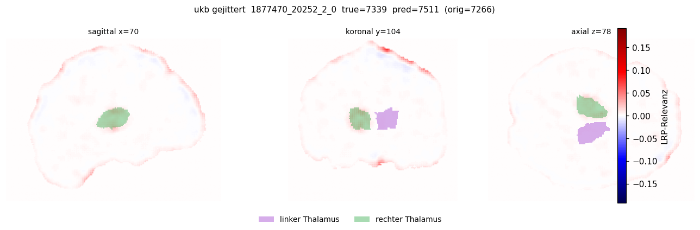

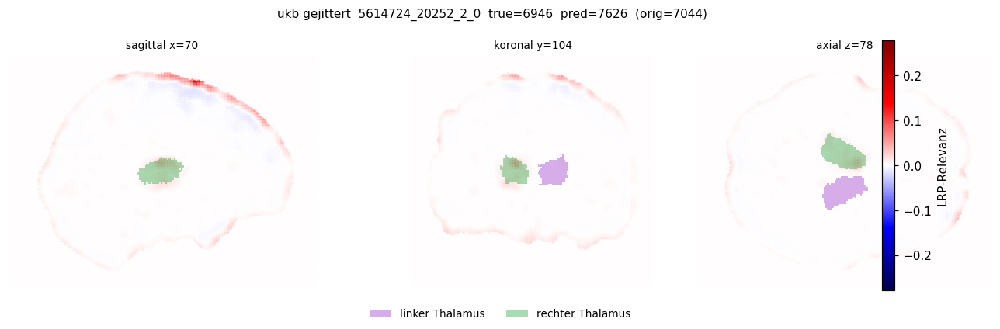

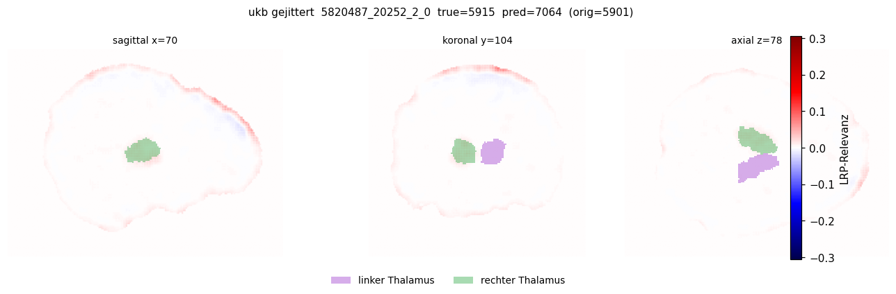

**Befund — das zentrale Ergebnis des Berichts:** Die Erwartung wird **nicht** erfüllt.
Die Vorhersagen sind nicht stabil. Sie verschieben sich um durchschnittlich **673 mm³**,
und zwar systematisch **nach oben** (alle vier Fälle). Zum Vergleich: Der mittlere
absolute Fehler des Modells auf denselben unmanipulierten Fällen liegt bei 53.7 mm³. Die
Manipulation des Umfelds — bei anatomisch **unverändertem** rechten Thalamus — verschiebt
die Vorhersage also um etwa das **12.5-Fache** des normalen Modellfehlers.

Bemerkenswert ist die Richtung: Die gejitterten Vorhersagen konvergieren auf einen engen
Bereich um 7000–7600 mm³, unabhängig vom wahren Wert. Bei `5820487` (wahres Volumen
5915 mm³, korrekt vorhergesagt als 5901) springt die Vorhersage auf 7064 — das Modell
verliert seine Fähigkeit zur Differenzierung fast vollständig und fällt in Richtung eines
mittleren Standardwerts zurück.

Auch die Heatmaps stützen das: Die Relevanz konzentriert sich in den gejitterten Volumes
nicht stärker auf den Thalamus, wie es die Hypothese verlangt hätte. Stattdessen ist sie
diffus und verlagert sich sichtbar an den **Gehirnrand** — bei `5614724` und `2784068`
sind ausgeprägte rote und blaue Bänder an der Kortexoberfläche zu sehen, während der
grüne Thalamus blass bleibt.

**Interpretation:** Das Modell benötigt den strukturellen Kontext außerhalb des
Thalamus. Der rechte Thalamus allein genügt ihm nicht, um das Volumen korrekt zu
bestimmen. Damit ist die Leitfrage aus Abschnitt 1.1 im Kern negativ beantwortet.

Eine methodische Vorsicht bleibt: Die vollständige Permutation ist ein sehr harter
Eingriff, der ein Volumen erzeugt, wie es in keinem Trainingsdatensatz vorkommt. Ein
Teil der Verschiebung kann daher auch reine Out-of-Distribution-Reaktion sein und muss
nicht bedeuten, dass das Modell die zerstörte Information inhaltlich *nutzt*. Ein
milderer Eingriff — etwa Glättung oder blockweise Permutation statt voxelweiser — wäre
der nächste Schritt, um beides zu trennen.

### 3.3 Jitter-trainiertes Modell (Abschnitt B.1)

**Ziel:** Der Gegenversuch zu B.3. Statt das Original-Modell mit manipuliertem Input zu
konfrontieren, wird hier ein Modell **von Grund auf auf gejitterten Volumes trainiert**
(`training_run_05h09m52s_04sep2026`) und dann auf den **originalen** Holdout-Volumes
getestet. Die Idee: Ein Modell, das nur mit erhaltenem Thalamus und zerstörtem Umfeld
gelernt hat, *muss* den Thalamus nutzen. Es wäre damit ein positives Referenzmodell für
den Vergleich mit A.8.

Die Ausgaben dieses Abschnitts wurden im Notebook nicht gespeichert. Teil C wertet aber
dasselbe Modell auf denselben originalen Volumes aus und liefert dessen Vorhersagen:


| Datensatz | Subject           | true | pred (Jitter-Modell) |
| --------- | ----------------- | ---- | -------------------- |
| IXI       | sub-470           | 8284 | **10000.0**          |
| UKB       | 2784068_20252_2_0 | 6873 | **10000.0**          |


**Befund:** Der Wert 10000.0 ist exakt die **Obergrenze** des in der Config definierten
Wertebereichs (`prediction_ranges: Right-Whole_thalamus: min 4000, max 10000`). Das
Jitter-Modell gibt für zwei völlig unterschiedliche Fälle aus zwei verschiedenen
Datensätzen denselben gesättigten Maximalwert aus.

Das Modell ist damit **nicht brauchbar**. Es hat entweder kollabiert (konstante Ausgabe
unabhängig vom Input) oder generalisiert überhaupt nicht von gejitterten auf originale
Volumes. Der geplante Vergleich mit A.8 lässt sich nicht durchführen, und dieser Zweig
des Arguments bleibt offen. Zu klären wäre, ob das Training divergierte, ob die
Zielvariablen-Skalierung fehlerhaft ist oder ob die Domain-Lücke zwischen gejittertem
Training und originalem Test einfach zu groß ist.

Auf den Rest des Berichts hat das keinen Einfluss: Der kausale Test in B.3 verwendet
ausschließlich das intakte Original-Modell.

### 2.5 Interaktiver 3D-Plot — Jitter-Modell (Abschnitt B.4)

**Ziel:** Derselbe 3D-Blick wie in A.10, aber mit LRP vom **Jitter-Modell**
(`training_run_05h09m52s_04sep2026`) auf denselben originalen Holdout-Volumes
(erstes Subject je Datensatz). So lässt sich die räumliche Relevanzverteilung des
gesättigten Modells (Vorhersage = 10000) direkt mit dem Original-Modell vergleichen.

- IXI `sub-470` → `[ixi_sub-470_thalamus_lrp_3d_jitter_model.html](ixi_sub-470_thalamus_lrp_3d_jitter_model.html)`
- UKB `2784068_20252_2_0` → `[ukb_2784068_20252_2_0_thalamus_lrp_3d_jitter_model.html](ukb_2784068_20252_2_0_thalamus_lrp_3d_jitter_model.html)`

Heatmaps zusätzlich als NIfTI unter
`<RUN_DIR>/heatmaps_jitter_model/<dataset>/<subject-id>/`.

---


## 4. Teil C — Relevanzerhaltung Schicht für Schicht

**Ziel dieses Teils:** Alle Prozentangaben aus Teil A setzen voraus, dass LRP Relevanz
nur **umverteilt** und nicht erzeugt oder vernichtet. Dieser Abschnitt prüft diese
Voraussetzung. Ohne ihn wäre nicht entscheidbar, ob ein Befund wie "0.73 % Relevanz im
rechten Thalamus" eine Eigenschaft des Modells oder ein Artefakt der Implementierung ist.

### 4.1 Was geprüft wird

Idealerweise gilt für jede Schicht ℓ

$$\sum_j R_j^{(\ell)} = \sum_k R_k^{(\ell+1)}$$

und am Eingang

$$\sum_i R_i^{(\mathrm{input})} \approx f(x)$$

also die skalare Regressions-Ausgabe. Sprünge in ΣR entlang des Rückwärtspfads sind
teilweise erwartbar und stammen typischerweise von der ε-Stabilisierung am Dense-Ausgang
(der Nenner wird absichtlich vergrößert), von den `flat`-Regeln an den frühen Convs
(`a ← 1` ist streng genommen nicht erhaltend) sowie von Bias- und Pooling-Behandlung.
**Sprünge über Größenordnungen** wären dagegen ein Warnsignal für einen echten
Implementierungsfehler.

Gemessen wird ΣR pro LRP-Schicht für das jeweils erste Subject beider Datensätze, einmal
mit dem Original-Modell und einmal mit dem Jitter-Modell. Der Input sind in beiden Fällen
die originalen Holdout-Volumes, damit der Modellvergleich fair bleibt.

### 4.2 Ergebnis


| Modell   | Datensatz | Subject | f(x)     | ΣR Start | ΣR Ende | **erhalten** |
| -------- | --------- | ------- | -------- | -------- | ------- | ------------ |
| Original | IXI       | sub-470 | 8156.85  | 8152.17  | 8214.61 | **100.77 %** |
| Original | UKB       | 2784068 | 6926.22  | 6923.03  | 6972.47 | **100.71 %** |
| Jitter   | IXI       | sub-470 | 10000.00 | 10000.00 | 9960.26 | **99.60 %**  |
| Jitter   | UKB       | 2784068 | 10000.00 | 10000.00 | 9957.97 | **99.58 %**  |


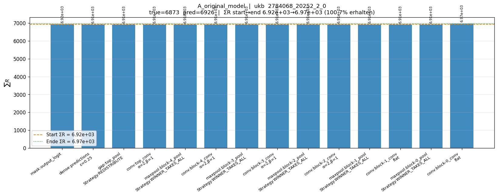


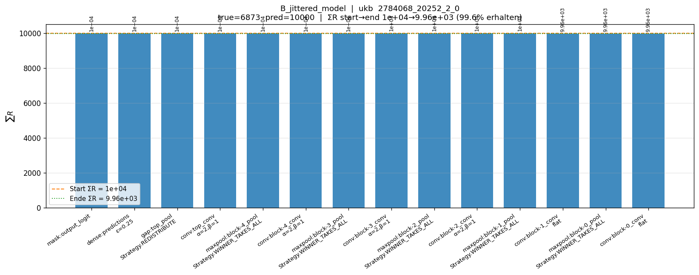

Der Verlauf im Detail, am Beispiel Jitter-Modell / UKB `2784068`:


| Schicht                | Regel            | ΣR       | Anteil am Start |
| ---------------------- | ---------------- | -------- | --------------- |
| `mask:output_logit`    | —                | 10000.00 | 1.0000          |
| `dense:predictions`    | ε = 0.25         | 9999.79  | 0.9999          |
| `gap:top_pool`         | Redistribute     | 9999.79  | 0.9999          |
| `conv:top_conv`        | α=2, β=1         | 9999.80  | 0.9999          |
| `maxpool:block-4_pool` | Winner-takes-all | 9999.80  | 0.9999          |
| `conv:block-4_conv`    | α=2, β=1         | 10000.03 | 1.0000          |
| `maxpool:block-3_pool` | Winner-takes-all | 10000.03 | 1.0000          |
| `conv:block-3_conv`    | α=2, β=1         | 10000.21 | 1.0000          |
| `maxpool:block-2_pool` | Winner-takes-all | 10000.21 | 1.0000          |
| `conv:block-2_conv`    | α=2, β=1         | 10000.37 | 1.0000          |
| `maxpool:block-1_pool` | Winner-takes-all | 10000.38 | 1.0000          |
| `conv:block-1_conv`    | **flat**         | 9961.13  | 0.9961          |
| `maxpool:block-0_pool` | Winner-takes-all | 9961.13  | 0.9961          |
| `conv:block-0_conv`    | **flat**         | 9957.97  | 0.9957          |


**Befund:** Die LRP-Implementierung ist sauber. Die Erhaltungsquote liegt in allen vier
Kombinationen zwischen 99.6 % und 100.8 %; die Kurven sind über den gesamten
Rückwärtspfad praktisch flach.

Interessant ist die Verteilung der Abweichungen. Der ε-Dense-Schritt, an dem man den
größten Verlust erwarten würde, ist nahezu verlustfrei (beim Jitter-Modell −0.21 von
10000). Die einzigen sichtbaren Sprünge liegen genau dort, wo die Theorie sie vorhersagt:
an den beiden `flat`-Convs nahe dem Eingang. Beim Jitter-Modell verlieren sie
zusammen 0.4 %, beim Original-Modell (IXI `sub-470`) *gewinnt* die letzte flat-Schicht
+77.6 hinzu, was die Erhaltungsquote über 100 % treibt. Beide Effekte sind für die
`flat`-Regel erwartbar und liegen weit von einem Größenordnungssprung entfernt.

Die Kurvenform ist zwischen Original- und Jitter-Modell und zwischen IXI und UKB
weitgehend identisch. Beide Modelle durchlaufen denselben LRP-Pfad korrekt; die
Niveauunterschiede folgen allein aus den unterschiedlichen f(x).

**Damit ist die Voraussetzung für Teil A bestätigt.** Die dort berichteten
Relevanzanteile sind keine Artefakte der LRP-Implementierung. Der Umstand, dass ΣR in A.9
nur rund 68 % der Vorhersage erreicht, ist vollständig durch die Hintergrund-Maskierung
erklärt — nicht durch Relevanzverlust im Netz.

---


## 5. Gesamtfazit

**Zur Leitfrage:** Das Modell nutzt den rechten Thalamus, aber es stützt sich nicht
überwiegend auf ihn.

Die drei Teile ergeben ein konsistentes Bild:

1. **Das Modell ist genau** (r = 0.988 auf IXI, r = 0.995 auf UKB), auf IXI jedoch mit
  systematischer Unterschätzung — ein Hinweis auf Domain-Shift.
2. **Die LRP-Messung ist vertrauenswürdig.** Relevanzerhaltung von 99.6–100.8 % über 59
  Schichten, mit Abweichungen ausschließlich an den theoretisch erwarteten Stellen.
3. **Der Thalamus ist angereichert, aber nicht dominant.** Relevanzdichte im Median 5.1×
  über Zufallsniveau — jedoch mit starker Streuung zwischen Fällen (1.8–12.4×) und in
   einem Fall mit mehr Relevanz im *linken* als im rechten Thalamus. 94–98 % der
   Gehirnrelevanz liegen außerhalb beider Thalami.
4. **Der kausale Test fällt negativ aus.** Wird das Umfeld permutiert und der rechte
  Thalamus exakt erhalten, verschiebt sich die Vorhersage um durchschnittlich 673 mm³ —
   das 12.5-Fache des normalen Modellfehlers — und konvergiert unabhängig vom wahren Wert
   auf einen mittleren Bereich. Das Modell braucht den extrathalamischen Kontext.

**Offene Punkte:**

- Das **Jitter-trainierte Modell ist defekt** (konstante Ausgabe an der Obergrenze
10000). Der Gegenversuch aus B.1 muss nach einer Ursachenanalyse wiederholt werden.
- **n = 5 pro Datensatz** trägt keine belastbare Statistik. Alle Kennzahlen sind
Plausibilitätsprüfungen.
- Die **voxelweise Permutation ist ein sehr harter Eingriff**. Mildere Varianten
(Glättung, blockweise Permutation, Austausch gegen ein anderes echtes Gehirn) würden
helfen, echte Kontextnutzung von reiner Out-of-Distribution-Reaktion zu trennen.
- Der **Domain-Shift zwischen IXI und UKB** (MAE 354 vs. 54) ist nicht aufgeklärt und
könnte auch die Relevanzverteilungen beeinflussen.
- Für **Teil B fehlen die Notebook-Ausgaben**; die zusammenfassenden Kennzahlen von B.1
und B.3 müssten durch einen erneuten Lauf nachgezogen werden.

---


## Anhang: Zugehörige Dateien

**Quell-Notebook**

- `notebooks/ipynb_files/analysis_LRP_for_right_thalamus_volume_based_on_CNN_prediction.ipynb`
- `notebooks/py_files/analysis_LRP_for_right_thalamus_volume_based_on_CNN_prediction.py`

**Ergebnisdaten** unter `output/notebooks/analysis_LRP_for_right_thalamus_volume_based_on_CNN_prediction/`


| Datei                                                     | Inhalt                                                       |
| --------------------------------------------------------- | ------------------------------------------------------------ |
| `layerwise_relevance/sum_R_conservation_summary.csv`      | Erhaltungsbilanz aller vier Modell-×-Datensatz-Kombinationen |
| `layerwise_relevance/sum_R_all_models_datasets.csv`       | vollständige Schichttabelle inkl. ReLU/NoOp                  |
| `layerwise_relevance/sum_R_{A,B}_*.csv`                   | Schichttabellen einzeln je Modell und Fall                   |
| `ixi_sub-470_thalamus_lrp_3d.html`                        | interaktiver 3D-Plot IXI (Original-Modell)                   |
| `ukb_2784068_20252_2_0_thalamus_lrp_3d.html`              | interaktiver 3D-Plot UKB (Original-Modell)                   |
| `ixi_sub-470_thalamus_lrp_3d_jitter_model.html`           | interaktiver 3D-Plot IXI (Jitter-Modell)                     |
| `ukb_2784068_20252_2_0_thalamus_lrp_3d_jitter_model.html` | interaktiver 3D-Plot UKB (Jitter-Modell)                     |
| `jitter_qc/`, `jitter_lrp/`                               | Teil-B-Grafiken                                              |


**Heatmaps** (NIfTI, 10 Dateien) unter
`<RUN_DIR>/heatmaps/<dataset>/<subject-id>/`, gejittert unter
`<RUN_DIR>/heatmaps_jittered/ukb/<subject-id>/`

**Relevanztabelle** `<RUN_DIR>/lrp_relevance_left_right_thalamus_by_subject.tsv`

**Grafiken dieses Berichts** unter `doc/notebooks/analysis_LRP_for_right_thalamus/images/`